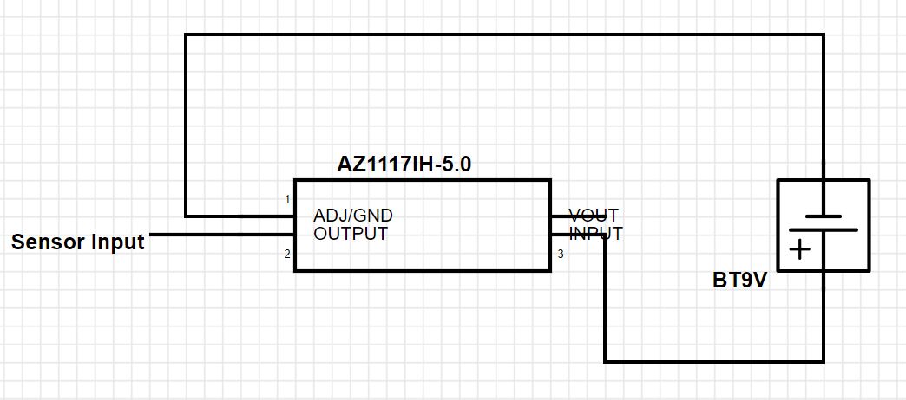

# Battery Subsystem

## **Function:**

Figure 1: Battery Subsystem

The goal of this subsystem is to provide 5 Volt power source to power the sensor subsystem

## **Constraints:**

|No.|Constraint|Origin|
|--|------|-------|
|1|The battery shall provide a constant 5-volt power supply|Conceptual Design|
|2|Must be mounted to or from a sensor stand|Conceptual Design|
|3|Input voltage should not exceed 10-volts|Device Constraint|

1. Using a voltage regulator will allow the sensor to be powered by a constant 5-volt power supply.
2. Using the 4" lead will allow the power supply to also be attached to the post with the sensor.
3. Using a 9-volt constant battery will allow the input voltage to not exceed the 10-volt max.

## **Buildable Schematics:**

Figure 2: Buildable Schematic 

## **Analyis:**
Based on the constraints given by the sensor’s voltage regulation and our conceptual design the team has decided to use the AZ1117IH-5.0TRG1 chip as a voltage regulator [3]. Due to each sensor needing to have its own battery to power itself the team has decided to use a 9-volt battery for each one. However, the sensor needs a 5-volt constant power supply to fix this problem we have decided to use a linear step-down voltage regulator [4] to make the voltage 5-volts. To connect the battery to this chip we are going to need a snap connection lead and solder it to a soldering bread board. To ensure that this batter provides enough power for our system the formula below has been used
Battery Life (in hours) = Battery Capacity (in Ah) / Load Current (in A)[5]
The average amps per hour for a 9-volt battery is 500 milliamps and the max current limit for the voltage regulator is 1.35 amps.
0.37hr=500x10^-3/1.35
Which is approximately 22 minutes so a battery charger will need to be purchased. This will prevent over purchasing batteries which will be more cost efficient and is more economically friendly

## **Bill of Materials:**

|Device|Quantity|Price|Total|
|-------|---|---------|-------------|
|AZ1117IH-5.0TRG1|4|$0.38|$1.52|
|EBL 9V Li-ion Rechargeable Batteries 600mAh 4-Pack with LCD 9V Smart Battery Charger|1|$29.99|$29.99|
|BATT CONN SNAP 9V 1 CEL 4" LEADS|4|$0.52|$2.08|
|BREADBOARD GENERAL PURPOSE|4|$1.95|$7.80|
| | |Final Total|$41.39|

## **References:**
[1] 232 Keystone Electronics | Battery Products | DigiKey, https://www.digikey.com/en/products/detail/keystone-electronics/232/303804 (accessed Apr. 10, 2024).

[2] Amazon.com:EBL 9V Li-ion Rechargeable Batteries 600mAh 4-Pack with LCD 9V Smart Battery Charger for 9 Volt Lithium-ion/Ni-MH/Ni-CD Rechargeable Batteries, https://www.amazon.com/EBL-Rechargeable-Batteries-Battery-Lithium-ion/dp/B08HRXHKQV/ref=sr_1_1_sspa?dib=eyJ2IjoiMSJ9.zOjHE_S7xCpuJg_qW9qaIHWWKzNAk6X9x6nbbJvQcAml1pLat0Qp6gE6hjGav7hVipmQwOd1hZ6Xz3-gLi750HOJbSCaH4My1LzDMnh_McgVyN71GdB4fgk4PLDQxto1xxpIpo8e2LfO9S1MgsJWF9Nk_fk0wCc3nVONYSh4iEOwny5j-oyUqnlXUPEjY8MfQmEoPNmtvm7jvLg7JCcPfxx8DkhAiHdf8CtZoYEm934.oRYXtEizD2QZeVMPUB5Kx8kCQZTfktmIgxK126JlqMg&dib_tag=se&keywords=9+volt+rechargeable+batteries+and+charger&qid=1712774892&sr=8-1-spons&sp_csd=d2lkZ2V0TmFtZT1zcF9hdGY&psc=1 (accessed Apr. 10, 2024). 

[3] Az1117i, https://www.diodes.com/assets/Datasheets/AZ1117I.pdf (accessed Apr. 10, 2024). 

[4] J. Teel, “How to pick the right voltage regulator(s) for your design,” PREDICTABLE DESIGNS, https://predictabledesigns.com/how-to-pick-the-right-voltage-regulators-for-your-design/ (accessed Apr. 10, 2024).

[5] F. Reis et al., “Battery life calculator: How long does a battery last? (ah, V, hours),” LearnMetrics, https://learnmetrics.com/battery-life-calculator-how-long-does-a-battery-last/ (accessed Apr. 10, 2024). 

[6] PRT-08808 sparkfun electronics | Prototyping, fabrication products | DigiKey, https://www.digikey.com/en/products/detail/sparkfun-electronics/PRT-08808/7387401 (accessed Apr. 10, 2024). 
