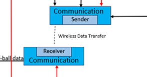
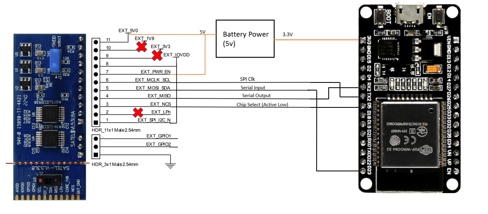
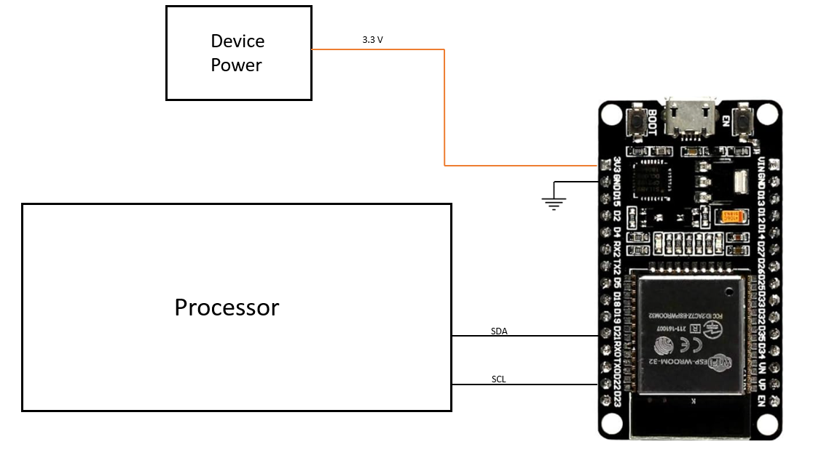

# Communication Subsystem

**Function:**

Figure 1 : Communication Subsystem

The goal of this subsystem is to recieve and transmit the data from the sensor subsystem to the processor.  

**Constraints:**

| NO. | Constraint                                                          | Origin           |
|-----|---------------------------------------------------------------------|------------------|
| 1   | The connection between the interceptor and sensors shall be a wireless connection.           |Conceptual Design |
| 2   | The wireless connection shall be protected and secured to maintain the integrity of the intercepting system                |Conceptual Design |
| 3   | The connection shall operate within the appropraite frequency ranges to meet federal requirments for free, unlicensed use             |Conceptual Design |
| 4   | The interceptor shall fit into a one-foot square on the floor and be able to fit in a one-by-one-by-one box                   |Conceptual Design|
| 5   | The wireless connection needs to transmit data fast enough for the interceptor to deflect the golf ball                   |Conceptual Design|
| 6   | The wireless system needs to span over the gameboard which is 64"x78"                  |System Requirments|
| 7   | The wireless system needs to transmit the data at a high enough speed for the golf ball to be intercepted                  |System Requirments|
| 8   | The wireless system needs to have pin connections that allow it to connect with the sensor and processor                 |System Requirments|
| 9   | The transmitter and reciever used for the wireless connection will need 3.3 volts for operation or another voltage supported by the board                 |Device Constraint|

1. The connection between the interceptor and sensors shall be a wireless connection. [Conceptual Design]
   The communication system is establishing the connection between the sensor and the processor within the intercepting device.

2. The wireless connection shall be protected and secured to amintain the integrity of the intercepting system. [Conceptual Design]
   The connection between the sensors and processors will be password protected. The microcontroller that will be used can generate its own Wifi connection and ensure only devices with the password can use the access point. 

3. The connection shall operate within the appropraite frequency ranges to meet federal requirments for free, unlicensed use. [Conceptual Design]
   The federal government requires Wifi operation within the ranges or either 2.4 GHz or 5 GHz. The microcontroller that will be used has both Wifi and bluetooth has connection options that operate in the 2.4 GHz.

4. The interceptor shall fit into a one foot square on the floor and be able to fit in a one-by-one-by-one box. [Conceptual Design]
   The reciver of the wireless communication system will be housed in the interceptor. The size of the mircocontroller will need to be considered to stay within this constraint.

5. The wireless connection needs to transmit data fast enough for the interceptor to deflect the golf ball. [Conceptual Design]
   If the data takes too long to be transmitted, the incoming golf ball will not be intercepted in time. The calculation made in the conceptual design determines that the connection speed needs to be at least 10.3 Mbps. The equipment used will be capable of reaching speeds this high.

6. The wireless system needs to span over the gameboard which is 64"x78". [System Requirments]
   The range of the connection needs to be able to span over the area that the transmitting microcontroller and recieving microcontroller.

7. The wireless system needs to transmit the data at a high enough speed for the golf ball to be intercepted. [System Requirments]
   The data needs to be transmitted quickly enough for the interceptor to process the data, aim, and fire at the incoming golf ball.
   
8. The wireless system needs to have pin connections that allow it to connect with the sensor and processor. [System Requirments]
   The data from the sensor uses either an I2C or SPI protocol to send the recieved data to a microcontroller. The microcontroller that will be needs to have pin connections to support these protcols and recieve the data.

9. The transmitter and reciever used for the wireless connection will need 3.3 volts for operation. [Device Constraint]
   The ESP-WROOM-32 microcontroller fulfills the constraints imposed by the stakeholders and the requirments of the other designs of the system. This device requires 3.3 volts for operation [1]. Certain board implementations can also be used to provide more This microcontroller will act as the reciever and transmitter since it is capable of creating its own Wifi network.

**Analysis:**

Based on the constraints given, the team has chosen the ESP-WROOM-32. This choice was made because of the wireless communication capablities and the support of both communication forms of the VL53L8CX sensor. Another reason this model was chosen is the ability to directly communicate with both the sensor and processor via pin connections while also being able to establish a wireless connection between two of the microcontrollers. The specific board chosen was the ESP32 DevKitC V4. This is simple and includes all the pin connections for the specific chip being used. It also offers extra power supply options with a USB port and a 5 volt input pin for extra flexibility. This board is also ‎4.92 x 3.58 x 0.75 inches making it small and compact for integrartion into the interceptor and on the sensor stand [2]. The exact specification and advantages of this choice will be further discussed.

The team is required to us a wireless connection to transmit the data from the sensors to the processor. The ESP-WROOM-32 was chosen to do this based on reccomendations from the stakeholders and the team's research. Since the sensor needs to communicate the data to a microcontroller, it is ideal to use a device that can interface with the sensors and has wireless communication capablities. The device was chosen for its flexibility and variety of options for interfacing and communication. It is able to use both SPI and I2C communication protocols which are the two protocols used by the sensor that will be used for the system. These communication protocols are common among many processors as well including the models of Raspberry pi that are being considered as the main processor for the system. This means the ESP-WROOM-32 should be able to make pin connections with the sensor to recieve the data and the processor to send the data. It also has a typical clock rate of 80 MHz which is fast enough to process the data rate the sensor samples at. It also has an internal memory that can store the recieved data unti the wireless connection from the board is able to send the information.

The mircocontroller is also capable of generating a Bluetooth or Wifi connection, making it ideal for the wireless communication as well. Both the wireless connections also operate within the 2.4 Ghz range which is in compliance with the FCC 15.247 federal standard. The team has determined that Wifi will need to be used since it is capable of higher transmission speeds than Bluetooth. This device offers speeds of up to 150 Mbps with the use of Wifi, so the team's goal of 10 to 11 Mbps is achievable with this microcontroller. This will allow the interceptor to process the informatio and fire at the golf ball. The Wifi connection can also be password protected with the proper code implementations. This can be done be establishing creating and requiring a key when creating the access point with the board connected to the sensor. This will only allow device's to connect if the password is also provided. The board acting as a reciever can then have the password in the code and send the password when trying to connect. This will allow only the transmitter and reciever to be on the network unless another device has the password. The team can test this by using our own devices to ensure the connection is only made when the password is provided. The transmitting power can be up to 19.5 dBm and the lowest power listed is 14 dBm [3]. Given this and the sensitivity of -88 dBm for 11 Mbps and -75 dBm for 54 Mbps it is reasonable to assume the area of the gameboard will be covered by the Wifi connection [3 & 4].

**Buildable Schematic**

Based on the pinouts and schematics for the ESP32 DevKitC V4, the communication between the sensor and the microcontroller for the SPI protocol are shown below. The diagram also includes the power supply for the board from the battery power. 

As seen in the diagram pins 30, 25, 24, and 23 are used for SPI communication. Pins 18, 13, 12, and 11 also have SPI communication capablities but were not used in this wiring diagram. There is a third set of SPI communication pins, but these do not directly correlate with the SPI pins on the sensor. The clock conncets to pin 24, the chip select connects to pin 23, the MISO connects to pin 25, and the MOSI connects to pin 30. These connections are made with the sensor to communicate the data captured by the sensor. The 3.3 volt input, pin 16, is connected to the battery power so the board can operate. Ground will be connected to the same source as the battery power and sensor. All other pins will not be connected unless a GPIO pin has to be integrated with the sensor to act as a clock. If that is the case, pin 10 will be used since the pin out does not have a specified purpose or configuration for it. If a second sensor is implemented on the posts, as opposed to it's current location on the interceptor, the connections to that sensor will be implemented the same way.

The team has also included a diagram for the connections between the mircocontroller and the processor. This diagram also includes the power supply for the board from the device power. This diagram assumes a connection of I2C to show the difference between the two interfaces. If SPI is used, the pin connections from the microcontroller will remain the same as above. If two connections are necessary for any reason, the other set of SPI communication pins will be used.

This diagram shows that pins 29 and 26 are used for I2C communication. While other GPIO pins can be configured to function for this communciation, these are the only two already configured for this communication protocol. All information about the pin assignments for both the board and microcontroller itself come from pinouts and schematics of the device and board.

**Bill of Materials:**

| Device | Quantity | Price | Total |
| ------ | -------- | ----- | ----- |
| ESP32 DevKitC V4 Board (3-pack)| 1 | $15.99 | $15.99 |

**References:**

[1] “ESP32-WROOM-32 (ESP-WROOM-32) datasheet,” Mouser, https://www.mouser.com/datasheet/2/891/esp-wroom-32_datasheet_en-1223836.pdf (accessed Apr. 7, 2024).

[2] ESP32-DEVKITC V4 getting started guide. ESP. (n.d.). https://docs.espressif.com/projects/esp-idf/en/stable/esp32/hw-reference/esp32/get-started-devkitc.html#get-started-esp32-devkitc-board-front (accessed Apr. 7, 2024). 

[3] “ESP32 series datasheet,” espressif, https://www.espressif.com/sites/default/files/documentation/esp32_datasheet_en.pdf (accessed Apr. 7, 2024).

[4] C. Downey, “Understanding wireless range calculations,” Electronic Design, https://www.electronicdesign.com/technologies/communications/article/21796484/understanding-wireless-range-calculations (accessed Apr. 7, 2024). 

[5] R. Teja, “ESP32 pinout: ESP-WROOM-32 pinout,” ElectronicsHub USA, https://www.electronicshub.org/esp32-pinout/ (accessed Apr. 7, 2024).

[6] “Esp32 module micro USB 5V&USB-UART,” espressif, https://dl.espressif.com/dl/schematics/esp32_devkitc_v4-sch.pdf (accessed Apr. 7, 2024). 
 
