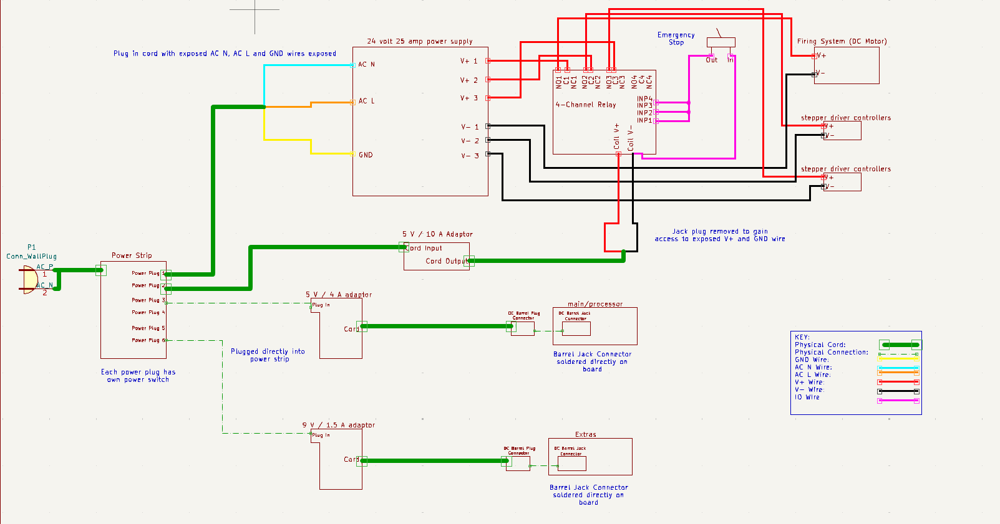
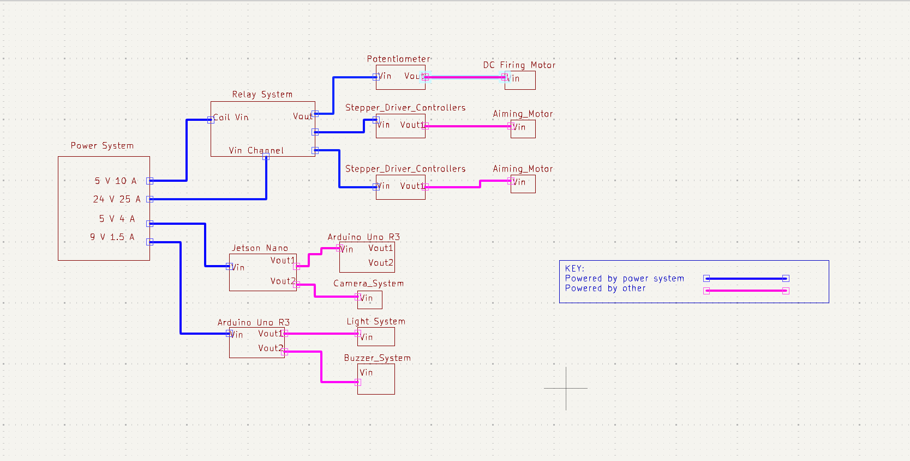

# Device Power Subsystem

**Function:**

Figure 1: Device Power Subsystem

The goal of this subsystem is to convert AC power from the wall outlet to DC power, and then distribute that power to the different device systems.  

**Constraints:**

| NO. | Constraint                                                          | Origin           |
|-----|---------------------------------------------------------------------|------------------|
| 1   | The power system shall be controlled by an emergency stop which will de-energize the mechanical system. This will shut off the motors which will not allow any projectiles to be fired. This will only be used if the system threatens peoples safety |Conceptual Design |
| 2   | The system shall convert wall outlet AC voltage to up to 24 volts at up to 20 amps for the mechanical system. This includes two DC motor controllers which requires 9-48 volts at 5 amps and the DC motor which will receieve anywhere from 12-24 volts at 10 amps |Conceptual Design |
| 3   | The system shall convert wall outlet AC voltage to up to 5 volts at up to 5 amps for the proccesor system, which requires 5 volts at 4 amps, relay coil which requires 5 volts as a high impendence input and the extra subsystem which requires 5 volts at 0.8 amps. |Conceptual Design |
| 4   | The system shall be controlled by a power switch                 |Conceptual Design |

1 The power system shall be controlled by an emergency stop which will de-energize the mechanical system. This will shut off the motors which will not allow any projectiles to be fired. This will only be used if the system threatens peoples safety  [Conceptual Design]

One of the requirements in the rulebook, given to us by the customer, is that the interceptor needs to have an emergency stop that de-energizes the interceptor. This emergency stop will cut power from the AC-DC convertor for the mechanical system to the motors themselves which will de-energize the interceptor. This system will only be used as a last case option if the interceptor threatens peoples safety. 

2 The system shall convert wall outlet AC voltage to up to 24 volts at up to 20 amps for the mechanical system. This includes two DC motor controllers which requires 9-48 volts at 5 amps and the DC motor which will receieve anywhere from 12-24 volts at 10 amps  [Conceptual Design]

The entire mechanical system will need up to 24 volts at 20 amps (480 watts). This will power one DC motor and two DC motor controllers. The DC motor requires 12 to 24 volts depending on the amount of RPMS required to fire the projectile at a specfic speed. The two DC motor controllers require anywhere from 9-48 watts depending on which type of motor it will control. The selected supply will supply 24 volts with a ripple percentage of +/- 5% [2]. This means it will supply up to 25.2 volts or as low as 23.8 volts. This is not an issue for either system as the controller can handle a much broader range and the motor will not be recieveing a max voltage as the mechanical team will limit it's voltage to allow the required RPM. 

3 The system shall convert wall outlet AC voltage to up to 5 volts at up to 5 amps for the proccesor system, which requires 5 volts at 4 amps, relay coil which requires 5 volts as a high impendence input and the extra subsystem which requires 5 volts at 0.8 amps. [Conceptual Design]

The system will need to power the extra subsystem, relay coil and the processor system. The extra system is a light and buzzer PCB. This system will be responsible for powering the lights on that PCB. There are current and voltage limiting resistors included on the board that will limit the supply voltage to the required voltage for the LEDS and allow them to run on 5 volts with head room for spikes. There are 2 types of LEDs, a red type which needs 0.05 amps and a green type which needs 0.02 amps. There will be 10 of each for a total of 0.7 amps. The processor system will be the Jetson Nano Devolper kit which will take 5 volts at 4 amps through the barrel jack connector. This supply will also need to power the relay coil which will require a 5 volt high impendence input. The power supply will have more than enough current to accomodate the relay. The power supply that will be used will be a 5 volt 10 amp power supply[1]. This power supply will have plenty of excess power head room to power every device it will need to power.

4  The system shall be controlled by a power switch.  [Conceptual Design]

The system will be controlled by an on/off switch. This switch will allow the wall power to be connected or disconnected from each system that this subsystem powers.  

## Buildable schematic 

*power subsystem buildable schematic*

The wires used for the mechanical system 

The input wire to the Jetson Nano will be a Barrel Jack connector cord rather than a micro-USB becuase the image processing system has ran it's calculations with the processor receiving this specfic draw.

*Entire project power schematic*

This is to show the power system is supplying power to everything it needs to power in order to accomplish everything this project is required to do. The power system will just supply power to three motors, the relay system, the processor and the extra system. Every other componet will be powered by another componet. 

## Analysis

| System        | Voltage    | Current   | Power       | 
|---------------|------------|-----------|-------------|
| Mechanical    | 24 Volts   | 20 Amps  | 480 Watts    |
| Processor     | 5 Volts    | 4 Amps    | 20 Watts    |
|Emergency      | 5 Volts    | 0.7 Amps   | 3.5 Watts    | 
|Total         |  |     | 503.5 Watts |

The above table details the different power draws that is required from this system. 

### Mechanical:

This power system will supply power to three main componets of the mechanical system. These componets are the firing mechanism's DC motor, and two stepper driver controllers that will control the aiming of the interceptor. The DC motor has a maximum voltage requirement of 24 volts with an amperage draw of 10 amps. It will be lowered to allow the correct RPM of the motor so the projectile does not exced the specified speeds. At worst case, this means the power draw of this system will be:

DC Motor Power Draw: (24 volts) * (10 amps) = 240 watts

The two stepper driver controllers have a voltage requirment between 9 and 48 volts. 24 volts will be given to this system so it can be powered by the same system. It's amprage draw is between 0-5 amps. The amperage of these controllers depends on the amount of power the actual motors need, so this system must be able to produce the maximum current so the motors can recieve the maximum current if needed. This means the total power draw of both controllers will be:

Single Controller Power Draw: (24 volts) * (5 amps) = 120 watts

Total Controller Power Draw: (120 watts) + (120 watts) = 240 watts

This places the maximum power draw of the entire system at:

Total Power draw of the Mechanical System: (240 watts) + (240 watts) = 480 watts

To acomplish the total power draw required, this system will utilize a power supply capable of supplying 600 watts of power[2]. This will give the system plenty of head room in powering the three componets as it will supply 120 more watts then is required.

### Extra:

The extra subsystem will be a PCB board that will be controlled by the processor system. This board will have 2 types of LEDs, and there will be 10 of each. The first type will be a green LED that will require 3 volts and 20 mAmps. It will receive 5 volts from the supply and will be limited to 3 volts using a 100 ohm resistor. There will be 10 of these so the total current draw will be:

Total current draw of the green LEDS: (10 * 0.02) = 0.2 amps  watts

The second type will be a red led which will require 2.5 volts and 0.05 amps. It will also receive 5 volts from the supply which will be limited by a 50 ohm resistor. There will also be 10 of these so the total current draw will be:

Total current draw of the red LEDS: (10 * 0.05) = 0.5 amps  watts

These means the total current draw and thus the total power draw of this system will be:

Total current draw of all LEDS: 0.2 + 0.5 = 0.7 amps  watts

Total Power draw of all LEDS: 5 volts * 0.7 amps = 3.5 watts  watts

This system will be powered by the 5 volt 10 amp supply that will also power the processor system and relay coil. 

### Processor:
The processor system will be controlled by a Jetson Nano developer kit. This Jetson Nano requires a voltage of 5 volts and an amperage draw of 4 amps. The total power draw of this system will then be:

(5 volts) * (4 amps) = 20 watts

To acomplish this power draw, the system will utilize the 5 volt 10 amp power supply that will also be powering the extra system and relay coil[1]. 

### Emergency Stop

In order for the emergency stop to properly de-energize the entire mechanical system, one switch must be able to operate on three seperate circuits. The way this system will accomplish this is through the use of a 1-channel relay componet. This one channel relay takes a 5 volt input to charge the coil. It will power this coil using the 5 volt 10 amp supply that is powering the extra system and Jetson Nano[1]. 

The single output of the 24 volt 25 amp power supply will be connected to the common input of the relay and there connected output will connect to the NC (normally closed) input. This will cause the 24 volt signal to output whenever the coil is not being connected to the 5 volt input. This is important as the emergency switch is supposed to shut power off when the switch is closed. Becuase of this when the emergency switch is closed the coil will begin charging causing the channel switch to close. This will output the NO (normally open) signal, which will not be connected to the motors. [4][5]

### Total Power

To achieve everything this system is required to do, the total power draw of this system will be:

(480 watts) + (3.5 watts) + (20 watts)  = 503.5 watts

This will be accomplished by using two seperate power supplies. The first will supply a total of 600 watts and will power the Mechanical system [2]. The second will supply a total of 50 watts and will power the emergency system, Jetson Nano and the relay coil[1].

(600 watts) + (50 watts) = 650 watts

The total supplied power of 650 watts will completely encapsulate the required wattage of 503.5 watts, and will allow the system to function correctly and accurately.

### Power Switch 

To accomplish the power switch constraint this system will utilize a power strip. This power strip will have six seperate plug ins each with it's own power switch. This system will utilize 2 of the six plugs as there are 2 power supplies being used in this system. The power strip selected is rated for 1875 watts of power which will comfortably encapsulate the 2 supplies being utilzed as the maximum power draw for this system is 503.5 watts. [3]

## BOM
|Item Name | Description | Subsystems | Part Number | Manufacturer | Quantity | Price | Total |
|----------|-------------|------------|-------------|--------------|----------|-------|-------|
|CCCEI Metal Power Strip Individual Switches 6 Outlets | 6 plugin power strip with 6 switches | Mechanical, Extra, Processor | B08HYLW3GX | CCCEI | 1 | 16.99 | 16.99 |
|Emergency stop switch | Switch will cause the relay to disconnect the power to the Mechanical system | Mechanical | B079FKJG26 | API Electric | 1 | 9.99 | 26.98 |
|5V 10A Power Supply Adapter | Power supply rated for 5 volts and 10 amps | Processor, Extra | 	B07CMM2BBR | Aclorol | 1 | 19.99 | 46.97 |
|DC 24V 25A 600W Power Supply | 600 watt power supply | Mechanical | 	B0BKY78JDX | NUOFUWEI | 1 | 49.99 | 96.96 |
| 1-channel relay | Relay that will disconnect the power to the motors | Mechanical | B07DSZFLMQ | NOYITO | 1 | 8.99 | 105.95 |
| 6-channel terminal block | 6-channel power block to split power | All | B09D3BV22M | CZH-LABS | 2 | 12.99 | 131.93 |

## References 

[1] Amazon.com: ACLOROL 5V 10A 50W power supply 100v-240v AC to DC Adapter 5V 10 AMP switching Converter 5.5x2.1mm plug for WS2811 WS2812B WS2813 5V led strip pixel lights : Tools & Home Improvement, https://www.amazon.com/Aclorol-100V-240V-Switching-Converter-5-5x2-1mm/dp/B07CMM2BBR (accessed Apr. 29, 2024). 

[2] Amazon.com: New Version DC 24V 25A 600W switching power supply adapter 110V AC to 24V DC converter power supply transformer for 24 Volt Winch Car Jack Monitor CCTV security camera car stereo and more 24V device : Electronics, https://www.amazon.com/Version-Switching-Converter-Transformer-Security/dp/B0BKY78JDX (accessed Apr. 29, 2024). 

[3] Amazon, https://www.amazon.com/Individual-Switches-Protector-Appliances-Extension/dp/B08HYLW3GX/ref=asc_df_B08HYLW3GX/?tag=hyprod-20&linkCode=df0&hvadid=647192999967&hvpos=&hvnetw=g&hvrand=12971397952727350175&hvpone=&hvptwo=&hvqmt=&hvdev=c&hvdvcmdl=&hvlocint=&hvlocphy=1025954&hvtargid=pla-2013978108223&mcid=3f30a49c0078360ebf82f79cd802428d&th=1 (accessed Apr. 16, 2024). 

[4] “30A 1-Channel Relay Module,” Amazon, https://www.amazon.com/NOYITO-1-Channel-Optocoupler-Automation-Industrial/dp/B07DSZFLMQ/ref=asc_df_B07DSZFLMQ/?tag=hyprod-20&linkCode=df0&hvadid=693410589815&hvpos=&hvnetw=g&hvrand=9427326199683501013&hvpone=&hvptwo=&hvqmt=&hvdev=c&hvdvcmdl=&hvlocint=&hvlocphy=1025954&hvtargid=pla-638405708371&mcid=fb5e44313b953d82b29ad0968e61019d&gad_source=1&gclid=CjwKCAjwxLKxBhA7EiwAXO0R0CZp_DMJtIQlnJBDNTpiRlktRrrJ6hAToPCag9EualsaD_xhrHixcRoCtRUQAvD_BwE&th=1 (accessed Apr. 29, 2024). 

[5] APIELE 22mm NC red mushroom emergency stop push button switch 600V 10 amp XB2-01ZS: Amazon.com: Industrial & Scientific, https://www.amazon.com/a12082000ux0309-Mushroom-Emergency-Button-ZB2-BE102C/dp/B079FKJG26 (accessed Apr. 23, 2024). 

[6] “30Amp 48V 2x6 Position Terminal Block,” Amazon, https://www.amazon.com/OONO-Position-Terminal-Distribution-Module/dp/B09D3BV22M/ref=asc_df_B09D3BV22M/?tag=hyprod-20&linkCode=df0&hvadid=533110574637&hvpos=&hvnetw=g&hvrand=10973354898479652102&hvpone=&hvptwo=&hvqmt=&hvdev=c&hvdvcmdl=&hvlocint=&hvlocphy=1025954&hvtargid=pla-1457134993109&psc=1&mcid=a1906572abf43679bd658b004ace500d&gclid=CjwKCAjwxLKxBhA7EiwAXO0R0JVhvSCwmtcfgJcPx-fdBBdNfHe22T96p_9NsPDzXmUqYMYpRjTJvBoC04cQAvD_BwE (accessed Apr. 29, 2024). 

