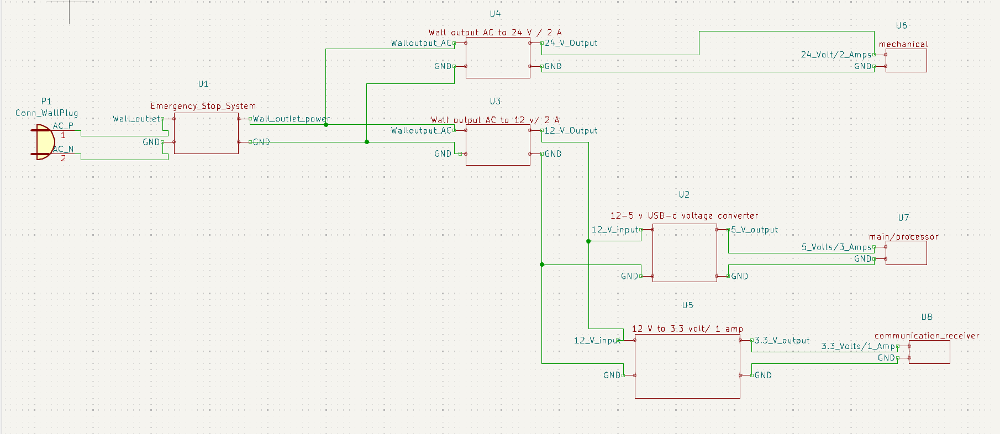

# Device Power Subsystem

**Function:**

Figure 1: Device Power Subsystem

The goal of this subsystem is to convert AC power from the wall outlet to DC power, and then distribute that power to the different device systems.  

**Constraints:**

| NO. | Constraint                                                          | Origin           |
|-----|---------------------------------------------------------------------|------------------|
| 1   | The power system shall be controlled by an emergency stop which will de-energize the device power system that will in turn de-energize the interceptor itself. This will only be used if the system threatens peoples safety |Conceptual Design |
| 2   | The system shall convert 100-120 wall outlet AC voltage to 24 Watts, which is required by the communication and main/processor unit, and 48 Watts DC, which is required by the mechanical unit  |Conceptual Design |
| 3   | The system shall provide a minimum of 63.18 Watts (1.2 times the minimum wattage)     |Design Constraint |
| 4   | The system shall be controlled by a power switch                 |Conceptual Design |
| 5   | The system shall be able to step down the power supply voltage to 5 volts, to power the main/processor unit, and 3.3 volts, to power the communication unit, respectively |Design Constraint |
| 6   | The system shall be able to produce 24 volts to power the mechanical unit (required voltage of that unit)    |Design Constraint |

1 The power system shall be controlled by an emergency stop which will de-energizes the device power system that will in turn de-energize the interceptor itself. [Conceptual Design]

One of the requirements in the rulebook, given to us by the customer, is that the interceptor needs to have an emergency stop that de-energizes the interceptor. This emergency stop will cut power from the wall outlet to the AC-DC convertors which will de-energize all of the systems that are being powered by this power system. This system will only be used as a last case option if the interceptor threatens peoples safety. 

2 The system shall convert 100-120 wall outlet AC voltage to 24 Watts, which is required by the communication and main/processor unit, and 48 Watts DC, which is required by the mechanical unit [Conceptual Design]

This system will take the 100-120 AC voltage supplied from the wall outlet and then convert that to 2 DC power signals that will be provided to the other subsystems. These DC signals are 24 Watts to the main/processor and communication receiver and 48 Watts to the mechanical unit.

3 The system shall provide a minimum of 63.18 Watts (1.2 times the minimum wattage) [Design Constraint]

Due to possible overclocking and power spikes, this system will provide 1.2 times the required wattage [1]. Because of this, the system will provide 63.18 watts of power, which is over 1.2 times the required wattage. This is shown in the below table:

| System | Required Voltage | Required Current | Required Power |
|--------|------------------|------------------|----------------|
| Mechanical | 24 Volts | 1.5 Amps | 36 Watts |
| Communication | 3.3 Volts | 0.5 Amps | 1.65 Watts |
| Processor | 5 Volts | 3 Amps | 15 Watts |
| Total | ---- | ---- | 52.65 |

63.18 Watts of power is 1.2 times the required total wattage of this system. This system will use AC-DC convertors that will supply 72 watts of power which will be well over the 1.2 requirement. 

4  The system shall be controlled by a power switch  [Conceptual Design]

The system will be controlled by an on/off switch. This switch will allow the wall power to be connected or disconnected from each system that this subsystem powers.  

5 The system shall be able to step down the power supply voltage to 5 volts, to power the main/processor unit, and 3.3 volts, to power the communication unit, respectively [Design Constraint]

The main/processor unit requires a voltage input of 5 volts. This system must be able to take the power supply voltage from the AC to DC convertor and step it down to 5 volts to power this unit. 

The communication receiver requires a voltage input of 3.3 volts. This system must be able to take the power supply voltage from the AC to DC convertor and step it down to 3.3 volts to power this unit. 

6 The system shall be able to produce 24 volts to power the mechanical unit  [Design Constraint]

The mechanical unit requires a voltage input of 24 volts. This system must be able to produce the 24 V DC signal from the wall outlet.

## Buildable schematic 

*power subsystem buildable schematic*

## Analysis

| System        | Voltage    | Current   | Power       | 
|---------------|------------|-----------|-------------|
| mechanical    | 24 Volts   | 1.5 Amps  | 36 Watts    |
| Communication | 3.3 Volts  | 500 mAmps | 1.65 Watts  |
| Processor     | 5 Volts    | 3 Amps    | 15 Watts    |
| Total         | 32.3 Volts | 5 Amps    | 52.65 Watts |

The above table details the different power draws that is required from this system. 

Mechanical:

The mechanical unit requires 24 volts and 1.5 amps. This means the total power needed will be:

~~~ math

(24 Volts) * (1.5 Amps) = 36 Watts

~~~

Communication:

The communication unit requires 3.3 volts and 500 mAmps. This means the total power needed will be:

~~~math

(3.3 Volts) * (500 mAmps) = 1.65 Watts

~~~

Processor:

The processor unit requires 5 Volts and 3 Amps. This means the total power needed will be:

~~~math

(5 Volts) * (3 Amps) = 15 Watts

~~~

Total subsystem power:

The total power of the entire subsystem will be:

~~~math

(36 Watts) + (1.65 Watts) + (15 Watts) = 52.65 Watts

~~~

## Fulfilling Constraints

This switch has one purpose and that is to de-energize the system. This can easily be done by cutting off the power directly at the source. This will be accomplished with the PRIME 3-Outlet Extension Cord with Lighted Footswitch [10]. This extension cord is rated for 13A and 125V. This will have a high enough current rating as this system will only be drawing up to 5 amps at up to 38.3 volts. 1

The system must convert AC power from the wall outlet and output a DC signal. This system will use two separate AC to DC converters. The first will produce a signal of 12 volts/ 2 amps (16.65 watts). This converter will power the two step-down transformers. The transformer will be the Chanzon 12V 2A Power Supply Class2 24W LED Strip CCTV Camera AC DC Switching Adapter [6]. The second will produce a signal of 24 volts/ 2 amps (48 watts). This converter will power the mechanical unit.
The transformer will be the AC to DC 24V 2A Power Supply Adapter, Plug 5.5mm x 2.1mm UL Listed FCC [8]. 2

The system must provide a total of 63.18 watts. This is because the total wattage of each system added together will be 52.65 watts:

~~~math
Total System Power: (36 Watts) + (1.65 Watts) + (15 Watts) = 52. 65 Watts
~~~

As stated above, the system will provide at least 1.2 times the amount of required power. This is why the system will need to provide 63.18 watts total. This will be done through two converters. The first will output a total of 24 watts. The systems it will support are the processor and communication systems, which require 16.65 watts. 24 watts is over 1.2 times that amount. The second will produce 48 watts. The system it supports requires 36 watts. 48 watts is over 1.2 times that amount. 3

This system will have a power switch connected between the AC-DC transformers and there adjacent outputs. Both converters will controlled using the KRE2ANA1BBD switch rocker [7]. This switch is rated for a max of 28 volts/ 6 amps. These ratings will completely encapsulate the requirements for each convertor. 4

The system must supply 5 volts/ 3 amps, and 3.3 volts/ 1 amp respectively. This will be accomplished by steping down the 12 volt/ 2 amp convertor in two different intervals. To supply 5 volts/ 3 amps the system will use the 12V to 5V DC USB Type-C Right Angle Step-Down Power Converter which takes a 12 volt input and outputs a 5 volt/ 3 amps signal [2]. To supply 3.3 volts / 1 amp the system will use the LM2596 which takes 12 volts and outputs a 3.3 volt signal at 1, 1.5 or 2 amp signal [3]. This system will output 1 amp.  5

The system must supply a 24 volt/ 1.5 amp signal for the mechanical unit. This will be done using the AC to DC 24V 2A Power Supply Adapter, Plug 5.5mm x 2.1mm UL Listed FCC, as it produces a 24 volt/ 2 amp output [8]. 6

## Application

To connect each system, there will be 2 soldered breadboards. One will connect the 12 volt convertor to the power switch and then connect that output to both of the step-down converters. The output of those will be connected to their actual systems. The second will connect the 24 volt converter to the switch and then connect the output of that switch to the actual system. The board that will be used will be a double-sided ENIG Protoboard [9].

There are also plans to 3d print a box to encapsulate each power system's components if time permits. 

## BOM

|Device     | Quantity | Price per  | Total price  |
|-----------|----------|------------|--------------|
|12-5v Buck Convertor| 1 | 15.99 | 15.99 |
|Chanzon 12V 2A Power Supply | 1 | 13.99 | 13.99 |
|AC to DC 24V 2A Power Supply Adapter | 1 | 9.99 | 9.99 |
|LM2596 DC to DC | 1 | 5.49 | 5.49|
|KRE2ANA1BBD | 2 | 3.20 | 6.40 |
|Solder Prototype Board 2x2 | 1 | 3.59 | 3.59 |
|PRIME Extension Cord | 1 | 6.98 | 6.98 |
|Total |8 | --- | 62.43 | 

## References 

[1] “How do you balance performance, reliability, and cost when installing a power supply?,” How to Install a Power Supply: Tips on Wattage, Efficiency, and Quality, https://www.linkedin.com/advice/0/how-do-you-balance-performance-reliability (accessed Apr. 7, 2024). 

[2] “12V to 5V DC USB Type-C Right Angle Step-Down Power Converter, Buck Converter, 15W Output, 3A at 5V USB Type-C Power Supply, Waterproof (12V to 5V USB-C Power Converter),” Amazon, 12V to 5V DC USB Type-C Right Angle Step-Down Power Converter, Buck Converter, 15W Output, 3A at 5V USB Type-C Power Supply, Waterproof (12V to 5V USB-C Power Converter) (accessed Apr. 7, 2024). 

[3] “LM2596S adjustable DC-DC step-down module,” ProtoSupplies, https://protosupplies.com/product/lm2596s-adjustable-dc-dc-step-down-module/ (accessed Apr. 7, 2024). 

[4] 3.0 A, step-down switching regulator LM2596, https://www.onsemi.com/pdf/datasheet/lm2596-d.pdf (accessed Apr. 8, 2024). 

[5] Amazon.com: 10Gtek# Buck Converter step Down Module LM2596 DC to DC voltage regulator, 3.0~40V to 1.5~35V Power Supply Module, pack of 2 : Automotive, https://www.amazon.com/10Gtek-Step-Down-Buck-Converter/dp/B0CBM7NKCF (accessed Apr. 8, 2024). 

[6] Amazon.com: Chanzon 12V 2A Power Supply class2 24W led strip CCTV Camera AC DC switching Adapter (input 100-240V, output 12 volt 2 amp) wall wart transformer charger for DC12V (6ft Cord, 24 Watt Max) : Electronics, https://www.amazon.com/Chanzon-Switching-Adapter-100-240V-Transformer/dp/B07HNL5D56 (accessed Apr. 8, 2024). 

[7] ZF, http://switches-sensors.zf.com/us/wp-content/uploads/sites/7/2012/10/Rocker_KR_Datasheet_08-11-17.pdf (accessed Apr. 8, 2024). 

[8] “AC to DC 24V 2A Power Supply Adapter, Plug 5.5mm x 2.1mm UL Listed FCC,” Amazon, https://www.amazon.com/Power-Supply-Adapter-5-5mm-Listed/dp/B08T636YVR/ref=asc_df_B08T636YVR/?tag=hyprod-20&linkCode=df0&hvadid=507792222889&hvpos=&hvnetw=g&hvrand=12806499727394812437&hvpone=&hvptwo=&hvqmt=&hvdev=c&hvdvcmdl=&hvlocint=&hvlocphy=1025954&hvtargid=pla-1262398291870&psc=1&mcid=edd9d085cf3b3cc6915cbdb81a548b03&gclid=Cj0KCQjwq86wBhDiARIsAJhuphlXeLT83NoSYTl9ESdo2cRMDwrTjeLdDQEmibtQ-LtuMLKLdhcwaioaAohBEALw_wcB (accessed Apr. 8, 2024). 

[9] “Schmalztech premium solderless breadboard/Electronics Prototyping Bread Board for quick circuit building, Arduino, or Raspberry Pi, st-BB (470 position): Amazon.com: Industrial & Scientific,” Amazon, https://www.amazon.com/SchmalzTech-Solderless-Breadboard-Electronics-Prototyping/dp/B0C3YZRMR5 (accessed Apr. 8, 2024). 

[10] “9FT 16/2 SPT-2 Green 3-Outlet Extension Cord W/Lighted Footswitch,” Prime Wire & Cable Inc., https://primewirecable.com/products/fsl7806099ft-16-2-spt-2-green-3-outlet-extension-cord-w-lighted-footswitch?_pos=1&_sid=f6715f7aa&_ss=r (accessed Apr. 6, 2024). ‌
