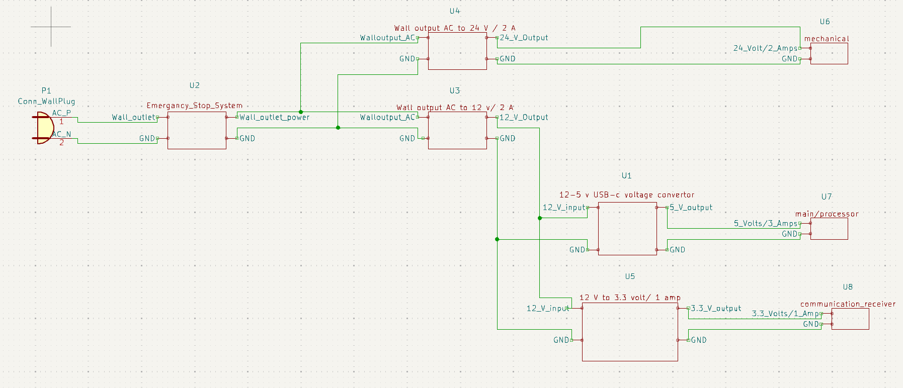

# Device Power Subsystem

**Function:**

Figure 1: Device Power Subsystem

The goal of this subsystem is to convert AC power from the wall outlet to DC power, and then distribute that power to the different device systems.  

**Constraints:**

| NO. | Constraint                                                          | Origin           |
|-----|---------------------------------------------------------------------|------------------|
| 1   | The power system shall be connected to the emergency stop           |Conceptual Design |
| 2   | The power system shall power the main/processor unit                |Conceptual Design |
| 3   | The power system shall power the communication receiver             |Conceptual Design |
| 4   | The power system shall power the mechanical unit                    |Conceptual Design |
| 5   | The system shall convert AC power to DC power                       |Conceptual Design |
| 6   | The system shall provide a minimum of 78.98 Watts                         |Design Constraint |
| 7   | The system shall have a connected power switch                      |Conceptual Design |
| 8   | The system shall be able to step down the voltage to 5 v and 3.3 v respectively |Design Constraint |
| 9   | The system shall be able to produce 24 volts                 |Design Constraint |

1 The power system shall be connected to the emergency stop [Conceptual Design]

The power system will be connected to the emergency stop which will act as an extension cord with a turn of switch. This emergency stop will be directly connected to the wall outlet.

2 The power system shall power the main/processor unit [Conceptual Design]

The system will need to be the primary power source for the main/processor unit. This system will be responsible for powering or providing the necessary power to every component in the main unit. 

3 The power system shall power the communication receiver [Conceptual Design]

The system will need to be the primary power source for the communication unit. This system will be responsible for powering or providing the necessary power to every component in the communication unit. 

4 The power system shall power the mechanical unit [Conceptual Design]

The system will need to be the primary power source for the mechanical unit. This system will be responsible for powering or providing the necessary power to every component in the mechanical unit. 

5 The system shall convert AC power to DC power [Conceptual Design]

This system will take the AC power supplied from the wall outlet and then convert that to a DC signal that will be provided to the other subsystems. 

6 The system shall provide a minimum of 78.98 W [Design Constraint]

Due to possible overclocking and power spikes, this system will provide 1.2 times the required wattage. [1] Because of this, the system will provide 78.98 watts of power, which is over 1.2 times the required wattage (52.65 watts). This will ensure there is plenty of power for the entire system. 

7  The system shall have a connected power switch [Conceptual Design]

The system will be controlled by an on/off switch. This switch will allow the wall power to be connected or disconnected from each system that this subsystem powers.  

8 The system shall be able to step down the voltage to 5 v and 3.3 v respectively [Design Constraint]

The main/processor unit requires a voltage input of 5 v. This system must be able to step down the DC voltage acquired by the wall outlet to 5 v to power this unit. 

The communication receiver requires a voltage input of 3.3 V. This system must be able to step down the DC voltage acquired by the wall outlet to 3.3 v to power this unit. 

9 The system shall be able to produce 24 volts   [Design Constraint]

The mechanical unit requires a voltage input of 24 v. This system must be able to produce the 24 volt DC signal from the wall outlet.

## Buildable schematic 

*power subsystem buildable schematic*

## Analysis

| System        | Voltage    | Current   | Power       | 
|---------------|------------|-----------|-------------|
| mechanical    | 24 Volts   | 1.5 Amps  | 36 Watts    |
| Communication | 3.3 Volts  | 500 mAmps | 1.65 Watts  |
| Processor     | 5 Volts    | 3 Amps    | 15 Watts    |
| Total         | 38.3 Volts | 5 Amps    | 52.65 Watts |

The above table details the different power draws that is required from this system. 

Mechanical:

The mechanical unit requires 24 volts and 1.5 amps. This means the total power needed will be:

~~~ math

(24 Volts) * (1.5 Amps) = 36 Watts

~~~

Communication:

The communication unit requires 3.3 volts and 500 mAmps. This means the total power needed will be:

~~~math

(3.3 Volts) * (500 mAmps) = 1.65 Watts

~~~

Processor:

The processor unit requires 5 Volts and 3 Amps. This means the total power needed will be:

~~~math

(5 Volts) * (3 Amps) = 15 Watts

~~~

Total subsystem power:

The total power of the entire subsystem will be:

~~~math

(36 Watts) + (1.65 Watts) + (15 Watts) = 52.65 Watts

~~~

## Fulfilling Constraints

As the schematic depicts this subsystem is connected to the emergency stop subsystem. The emergency stop subsystem is connected to the wall outlet. This allows the power subsystem to be disconnected from power completely if needed. 1

The main/processor unit requires a 5 volt/ 3 amp input (15 Watts). The 12V to 5V DC USB Type-C Right Angle Step-Down Power Converter takes a 12 volt input and outputs a 5 volt/ 3 amp signal. [2] This is exactly what the wall outlet transformer produces and it is exactly what the main/processor requires. 2

The communication receiver requires a 3.3 volt/ 0.5 amp (or more) input (1.65 Watts). The LM2596 takes a 12 volt input and can convert a 3.3 volt output with a 1 amp, 1.5 amp, or 2 amp signal.[3] This system will output a 3.3 volt/ 1 amp output. This will be sufficient as the wall outlet transformer produces 12 volts and it encapsulates what is required by the communication receiver. 3

The mechanical unit requires a 24 volt/ 1.5 amp input (36 watts). The AC to DC 24V 2A Power Supply Adapter, Plug 5.5mm x 2.1mm UL Listed FCC produces a 24 volt/ 2 amp output from the wall outlet. [8] This will be sufficient as it will completely encapsulate what is required from the mechanical unit. 4

The system must convert AC power from the wall outlet and output a DC signal. This system will use two separate AC to DC converters. The first will produce a signal of 12 volts/ 2 amps (16.65 watts). This converter will power the two step-down transformers. The transformer will be the Chanzon 12V 2A Power Supply Class2 24W LED Strip CCTV Camera AC DC Switching Adapter. [6] The second will produce a signal of 24 volts/ 2 amps (48 watts). This converter will power the mechanical unit.
The transformer will be the AC to DC 24V 2A Power Supply Adapter, Plug 5.5mm x 2.1mm UL Listed FCC. [8] 5

The system must provide a total of 78.98 watts. This is because the total wattage of each system added together will be 52.65 watts:

~~~math
Total System Power: (36 Watts) + (1.65 Watts) + (15 Watts) = 52. 65 Watts
~~~

As stated above, the system will provide at least 1.2 times the amount of required power. This is why the system will need to provide 78.98 watts total. This will be done through two converters. The first will output a total of 24 watts. The systems it will support are the processor and communication systems, which require 16.65 watts. 24 watts is over 1.2 times that amount. The second will produce 48 watts. The system it supports requires 36 watts. 48 watts is over 1.2 times that amount. 6

This system will have a power switch connected between the AC-DC transformers and there adjacent outputs. Both converters will controlled using the KRE2ANA1BBD switch rocker.[7] This switch is rated for a max of 28 volts/ 6 amps. These ratings will completely encapsulate the requirements for each convertor. 7

As stated in fulfilling constraints 2 and 3, the system must supply 5 volts/ 3 amps, and 3.3 volts/ 1 amp respectively. This will done by using the 12V to 5V DC USB Type-C Right Angle Step-Down Power Converter to supply the 5 volt system, and the LM2596 to power the 3.3 volt system. [2][3] 8

As stated in fulfilling constraint 4, the system must supply a 24 volt/ 1.5 amp signal. This will be done using the AC to DC 24V 2A Power Supply Adapter, Plug 5.5mm x 2.1mm UL Listed FCC, as it produces a 24 volt/ 2 amp output. [8] 9

## Application

To connect each system, there will be 2 soldered breadboards. One will connect the 12 volt convertor to the power switch and then connect that output to both of the step-down converters. The output of those will be connected to their actual systems. The second will connect the 24 volt converter to the switch and then connect the output of that switch to the actual system. The board that will be used will be a double-sided ENIG Protoboard, Solderable Breadboard of varying sizes. [9]

There are also plans to 3d print a box to encapsulate each power system's components if time permits. 

## BOM

|Device     | Quantity | price per  | total price  |
|-----------|----------|------------|--------------|
|12-5v Buck Convertor| 1 | 15.99 | 15.99 |
|Chanzon 12V 2A Power Supply | 1 | 13.99 | 13.99 |
|AC to DC 24V 2A Power Supply Adapter | 1 | 9.99 | 9.99 |
|LM2596 DC to DC | 1 | 5.49 | 5.49|
|KRE2ANA1BBD | 2 | 3.20 | 6.40 |
|Solder Prototype Board 2x2 | 1 | 3.59 | 3.59 |
|total |7 | --- | 55.45 | 

## References 

[1] “How do you balance performance, reliability, and cost when installing a power supply?,” How to Install a Power Supply: Tips on Wattage, Efficiency, and Quality, https://www.linkedin.com/advice/0/how-do-you-balance-performance-reliability (accessed Apr. 7, 2024). 

[2] “12V to 5V DC USB Type-C Right Angle Step-Down Power Converter, Buck Converter, 15W Output, 3A at 5V USB Type-C Power Supply, Waterproof (12V to 5V USB-C Power Converter),” Amazon, 12V to 5V DC USB Type-C Right Angle Step-Down Power Converter, Buck Converter, 15W Output, 3A at 5V USB Type-C Power Supply, Waterproof (12V to 5V USB-C Power Converter) (accessed Apr. 7, 2024). 

[3] “LM2596S adjustable DC-DC step-down module,” ProtoSupplies, https://protosupplies.com/product/lm2596s-adjustable-dc-dc-step-down-module/ (accessed Apr. 7, 2024). 

[4] 3.0 A, step-down switching regulator LM2596, https://www.onsemi.com/pdf/datasheet/lm2596-d.pdf (accessed Apr. 8, 2024). 

[5] Amazon.com: 10Gtek# Buck Converter step Down Module LM2596 DC to DC voltage regulator, 3.0~40V to 1.5~35V Power Supply Module, pack of 2 : Automotive, https://www.amazon.com/10Gtek-Step-Down-Buck-Converter/dp/B0CBM7NKCF (accessed Apr. 8, 2024). 

[6] Amazon.com: Chanzon 12V 2A Power Supply class2 24W led strip CCTV Camera AC DC switching Adapter (input 100-240V, output 12 volt 2 amp) wall wart transformer charger for DC12V (6ft Cord, 24 Watt Max) : Electronics, https://www.amazon.com/Chanzon-Switching-Adapter-100-240V-Transformer/dp/B07HNL5D56 (accessed Apr. 8, 2024). 

[7] ZF, http://switches-sensors.zf.com/us/wp-content/uploads/sites/7/2012/10/Rocker_KR_Datasheet_08-11-17.pdf (accessed Apr. 8, 2024). 

[8] “AC to DC 24V 2A Power Supply Adapter, Plug 5.5mm x 2.1mm UL Listed FCC,” Amazon, https://www.amazon.com/Power-Supply-Adapter-5-5mm-Listed/dp/B08T636YVR/ref=asc_df_B08T636YVR/?tag=hyprod-20&linkCode=df0&hvadid=507792222889&hvpos=&hvnetw=g&hvrand=12806499727394812437&hvpone=&hvptwo=&hvqmt=&hvdev=c&hvdvcmdl=&hvlocint=&hvlocphy=1025954&hvtargid=pla-1262398291870&psc=1&mcid=edd9d085cf3b3cc6915cbdb81a548b03&gclid=Cj0KCQjwq86wBhDiARIsAJhuphlXeLT83NoSYTl9ESdo2cRMDwrTjeLdDQEmibtQ-LtuMLKLdhcwaioaAohBEALw_wcB (accessed Apr. 8, 2024). 

[9] “Schmalztech premium solderless breadboard/Electronics Prototyping Bread Board for quick circuit building, Arduino, or Raspberry Pi, st-BB (470 position): Amazon.com: Industrial & Scientific,” Amazon, https://www.amazon.com/SchmalzTech-Solderless-Breadboard-Electronics-Prototyping/dp/B0C3YZRMR5 (accessed Apr. 8, 2024). 

