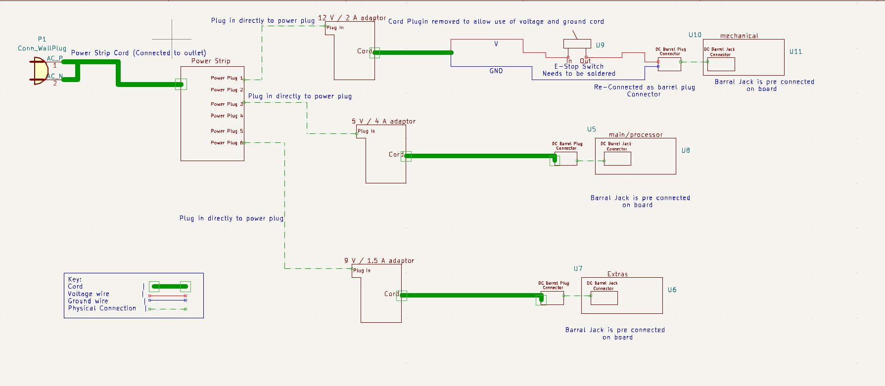

# Device Power Subsystem

**Function:**

Figure 1: Device Power Subsystem

The goal of this subsystem is to convert AC power from the wall outlet to DC power, and then distribute that power to the different device systems.  

**Constraints:**

| NO. | Constraint                                                          | Origin           |
|-----|---------------------------------------------------------------------|------------------|
| 1   | The power system shall be controlled by an emergency stop which will de-energize the mechanical system.This will shut off the motors which will not allow any projectiles to be fired. This will only be used if the system threatens peoples safety |Conceptual Design |
| 2   | The system shall convert 100-120 wall outlet AC voltage to 20 watts, which is required by the main/processor unit, 13.5 watts, which is required by the extra subsytem and 48 Watts DC, which is required by the mechanical unit |Conceptual Design |
| 3   | The system shall be controlled by a power switch                 |Conceptual Design |
| 4   | The system shall be able to produce 5 volts to power the main/processor unit (required voltage of that unit) |Design Constraint |
| 5   | The system shall be able to produce 24 volts to power the mechanical unit (required voltage of that unit)    |Design Constraint |
| 6   | The system shall be able to produce 9 volts to power the extra subsystem (required voltage of that unit) |Design Constraint |

1 The power system shall be controlled by an emergency stop which will de-energize the mechanical system. This will shut off the motors which will not allow any projectiles to be fired. This will only be used if the system threatens peoples safety  [Conceptual Design]

One of the requirements in the rulebook, given to us by the customer, is that the interceptor needs to have an emergency stop that de-energizes the interceptor. This emergency stop will cut power from the AC-DC convertor for the mechanical system to the motors themselves which will de-energize the interceptor. This system will only be used as a last case option if the interceptor threatens peoples safety. 

2 The system shall convert 100-120 wall outlet AC voltage to 20 watts, which is required by the main/processor unit, 13.5 watts, which is required by the extra subsytem and 48 Watts DC, which is required by the mechanical unit [Conceptual Design]

This system will take the 100-120 AC voltage supplied from the wall outlet and then through three seperate AC-DC adaptors will output 20 watts, 13.5 watts and 48 watts respectively.

3  The system shall be controlled by a power switch  [Conceptual Design]

The system will be controlled by an on/off switch. This switch will allow the wall power to be connected or disconnected from each system that this subsystem powers.  

4  The system shall be able to produce 5 volts to power the main/processor unit (required voltage of that unit)  [Design Constraint]

The main/processor unit requires a voltage input of 5 volts. This system must be able to produce the 5 V DC signal from the wall outlet.

5 The system shall be able to produce 24 volts to power the mechanical unit  [Design Constraint]

The mechanical unit requires a voltage input of 24 volts. This system must be able to produce the 24 V DC signal from the wall outlet.

6 The system shall be able to produce 9 volts to power the extra subsystem (required voltage of that unit) [Design Constraint]

The extra subsystem requires a voltage input of 9 volts. This system must be able to produce the 9 V DC signal from the wall outlet.

## Buildable schematic 

*power subsystem buildable schematic*

## Analysis

| System        | Voltage    | Current   | Power       | 
|---------------|------------|-----------|-------------|
| mechanical    | 24 Volts   | 1.5 Amps  | 36 Watts    |
| Communication | 9 Volts  | 500 mAmps | 4.5 Watts  |
| Processor     | 5 Volts    | 4 Amps    | 20 Watts    |
| Total         | 38 | 6    | 60.5 Watts |

The above table details the different power draws that is required from this system. 

Mechanical:

The mechanical unit requires 24 volts and 1.5 amps. This means the total power needed will be:

~~~ math

(24 Volts) * (1.5 Amps) = 36 Watts

~~~

Communication:

The communication unit requires 9 volts and 500 mAmps. This means the total power needed will be:

~~~math

(9 Volts) * (500 mAmps) = 4.5 Watts

~~~

Processor:

The processor unit requires 5 Volts and 4 Amps. This means the total power needed will be:

~~~math

(5 Volts) * (4 Amps) = 15 Watts

~~~

Total subsystem power:

The total power of the entire subsystem will be:

~~~math

(36 Watts) + (4.5 Watts) + (20 Watts) = 60.5 Watts

~~~

## Fulfilling Constraints

This switch has one purpose and that is to de-energize the mechanical system. This can be done by cutting off the power from the AC-DC convertor to the motors themselves. This will be accomplished with the 7105SYZQE [5]. This switch is rated for 5 amps/ 28 volts DC. This will completely encapsulate the power produced by the mechanical transformer. 1

The system must convert AC power from the wall outlet and output a DC signal. This system will use three separate AC to DC converters. The first will produce a signal of 5 volts/ 4 amps (20 watts). This converter will power the main/processor. The transformer will be the 5V 4A Power Supply Adapter - COOLM AC 100-240V to DC 5V/4A 20W Charger Plug DC 5.5mm x 2.5mm Universal [2]. This transformer was designed to power a Jetson Nano. The second will produce a signal of 24 volts/ 2 amps (48 watts). This converter will power the mechanical unit. The transformer will be the AC to DC 24V 2A Power Supply Adapter, Plug 5.5mm x 2.1mm UL Listed FCC [4]. The final will produce a 9 volt/ 1.5 amp signal (13.5 watts). This convertor will be the Gonine 9V DC Power Supply Cord, 9Volt 1.5A AC DC Adapter for 9Vdc Arduino UNO R3 [1]. This transformer was designed to power the Arduino UNO R3. 2

This system will have three power switchs connected between the AC-DC transformers and the wall outlet. All converters will be controlled using the CCCEI Metal Power Strip Individual Switches 6 Outlets [3]. This power switch is rated for a max of 125 volts/ 15 amps, or 1875 watts. These ratings will completely encapsulate the requirements for each convertor. 3

To supply the appropriate amount of power to the Jetson Nano, the system must produce 5 volts. To achieve this, the system will use the 5V 4A Power Supply Adapter - COOLM AC 100-240V to DC 5V/4A 20W Charger Plug DC 5.5mm x 2.5mm Universal [2]. This convertor was designed to power Jetson Nanos and produces exactly what the processor needs. 4

The system must supply a 24 volt/ 1.5 amp signal for the mechanical unit. This will be done using the AC to DC 24V 2A Power Supply Adapter, Plug 5.5mm x 2.1mm UL Listed FCC, as it produces a 24 volt/ 2 amp output [4]. 5

To supply the appropriate amount of power to the Arduino UNO R3, the system must produce 9 volts. To achieve this, the system will use the Gonine 9V DC Power Supply Cord, 9Volt 1.5A AC DC Adapter for 9Vdc Arduino UNO R3 [1]. This convertor was designed to power Arduino UNO R3s and produces exactly what the extra system needs. The system only needs 0.5 A, but by using this supply, the Arduino will only draw what it needs. 6

## BOM
|Item Name | Description | Subsystems | Part Number | Manufacturer | Quantity | Price | Total |
|----------|-------------|------------|-------------|--------------|----------|-------|-------|
|AC to DC 24V 2A Power Supply Adapter | Converts wall outlet power to a 24V/ 2A output | Mechanical | B07RTWD725 | Security-01 | 1 | 9.99 | 9.99 |
|12V DC Power Connector | 10 male and 10 female 12V DC Power Connectors | Mechanical | ‎DCPLUG-MF | CENTROPOWER | 1 | 7.99 | 17.98 |
|CCCEI Metal Power Strip with 6 Outlets | Acts as the power switches between the AC adaptors and the wall for each system | Mechanical, Processor, Extra | B08HYLW3GX | CCCEI | 1 | 16.99 | 34.97 |
| E-stop switch (7105SYZQE) | Toggle switch rated for 120 V/ 5A | Mechanical | 7105SYZQE | C&K | 1 | 10.89 | 45.86 |
|5V 4A Power Supply Adapter | Converts wall outlet power to a 5V/ 4A output | Processor | B07RTWD725 | COOLM | 1 | 13.68 | 59.54 |
|Gonine 9V DC Power Supply Cord | Converts wall outlet power to a 9V/ 1.5A output | Extra | B099J3JCVX |69 Gonine | 1 | 12.69 | 72.23 |

## References 

[1] Amazon, https://www.amazon.com/Gonine-5-5x2-1mm-Positive-Connector-Elliptical/dp/B099J3JCVX/ref=sr_1_1_sspa?crid=PDOUNUYWJ2B9&dib=eyJ2IjoiMSJ9.DJoK0_iOF_aAvsQ3QTa63W7iStx7BwVycj7Q1kl-PXtBLvlEaBwqgG6gtWA8PbD0Pj3ScHu33EI9rB3q83JOwQOaTEeChCkqDVHIeSJvLMLoOfzRVe8galg447OFLraCADJLGRl8nRRVqM07tapisdxicN7Ti7NdJ2gpvM41qR_SDix9Tqm8iRB4G1L3mphy0nhB-nHj8vJP2KhA4ZPjADA87iALTsqvwnnskK2TbH3c4f8Ec2eN8c0EF80YXXX3q1geBsunN407VK1EZmhQxqc_HNy_UdLM57_ruaM_QUg.E6YjSVNYmqFjQegxH1kKLQZPtozE0ootNyhxLe2Ou2c&dib_tag=se&keywords=arduino+uno+r3+power+supply&qid=1713303820&s=electronics&sprefix=arduino+uno+r3+power+supply%2Celectronics%2C90&sr=1-1-spons&sp_csd=d2lkZ2V0TmFtZT1zcF9hdGY&psc=1 (accessed Apr. 16, 2024). 

[2] Amazon, https://www.amazon.com/5V-Power-Supply-Adapter-Universal/dp/B07RTWD725/ref=sr_1_1_sspa?crid=1OU1EJ4H7X9BT&dib=eyJ2IjoiMSJ9.sXmGimoCjSyPLAbJTSi1qaMPM7xYBu2pLDlTtzcteTO3oDI0TMAshqyQnxJYDEYHpUoCurrPArHwJW7kO2ipm9MmgS-NAF6OLQj48GTgYJYLTzAsKkSoX_MnvI4mQLLxzvl9vu_BY5mQ-JXqkI16cp6DiZRwXpRfrVIF96KMxyoA18KmddLYUZkxDVNXNKaUJaJo8UFwV7_Y1RUX_TlRKzGKPTkZSGDgxEZnbJcxl5svoI44vs7zIEWi-fPMpM7McsCO2mVNEIpRqAixbON8vHwa2b4EJ4yywpdkxMSQAjk.qAJk2VW_ASJKmJ1jde06lwT246mCHOzZ5rIuJDCZgWo&dib_tag=se&keywords=jetson%2Bnano%2Bpower%2Bsupply%2B5v%2B4a&qid=1713303744&s=electronics&sprefix=jetson%2Bnano%2Bpower%2Celectronics%2C82&sr=1-1-spons&sp_csd=d2lkZ2V0TmFtZT1zcF9hdGY&th=1 (accessed Apr. 16, 2024).  

[3] Amazon, https://www.amazon.com/Individual-Switches-Protector-Appliances-Extension/dp/B08HYLW3GX/ref=asc_df_B08HYLW3GX/?tag=hyprod-20&linkCode=df0&hvadid=647192999967&hvpos=&hvnetw=g&hvrand=12971397952727350175&hvpone=&hvptwo=&hvqmt=&hvdev=c&hvdvcmdl=&hvlocint=&hvlocphy=1025954&hvtargid=pla-2013978108223&mcid=3f30a49c0078360ebf82f79cd802428d&th=1 (accessed Apr. 16, 2024). 

[4] “AC to DC 24V 2A Power Supply Adapter, Plug 5.5mm x 2.1mm UL Listed FCC,” Amazon, https://www.amazon.com/Power-Supply-Adapter-5-5mm-Listed/dp/B08T636YVR/ref=asc_df_B08T636YVR/?tag=hyprod-20&linkCode=df0&hvadid=507792222889&hvpos=&hvnetw=g&hvrand=12806499727394812437&hvpone=&hvptwo=&hvqmt=&hvdev=c&hvdvcmdl=&hvlocint=&hvlocphy=1025954&hvtargid=pla-1262398291870&psc=1&mcid=edd9d085cf3b3cc6915cbdb81a548b03&gclid=Cj0KCQjwq86wBhDiARIsAJhuphlXeLT83NoSYTl9ESdo2cRMDwrTjeLdDQEmibtQ-LtuMLKLdhcwaioaAohBEALw_wcB (accessed Apr. 8, 2024). 

[5] 7000 series miniature toggle switches, https://www.ckswitches.com/media/1394/7000toggle.pdf (accessed Apr. 16, 2024). ‌

[6] Amazon, https://www.amazon.com/Power-Connector-Female-Adapter-Camera/dp/B07C61434H/ref=asc_df_B07C61434H/?tag=&linkCode=df0&hvadid=366410038949&hvpos=&hvnetw=g&hvrand=13676490397966405418&hvpone=&hvptwo=&hvqmt=&hvdev=c&hvdvcmdl=&hvlocint=&hvlocphy=1025954&hvtargid=pla-802228450796&mcid=6bdef984700c3733812519939dcd2cd0&ref=&adgrpid=75347436719&gclid=CjwKCAjw5v2wBhBrEiwAXDDoJfHTcq-kv3VJspmvW-KItjRY-NGxdCKbqlVLe42_jJeCY38wutk-CRoCieQQAvD_BwE&th=1 (accessed Apr. 17, 2024).  
