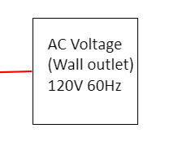

# Device Power Subsystem

**Function:**

Firgure 1 : Device Power Subsystem

The goal of this subsystem is to convert AC power from the wall outlet to DC power, then distribute that power to the different device systems.  

**Constraints:**

| NO. | Constraint                                                          | Origin           |
|-----|---------------------------------------------------------------------|------------------|
| 1   | The power system shall be connected to the emergancy stop           |Conceptual Design |
| 2   | 
