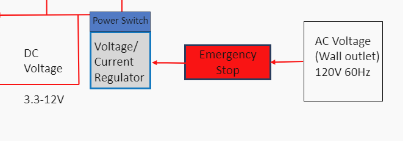
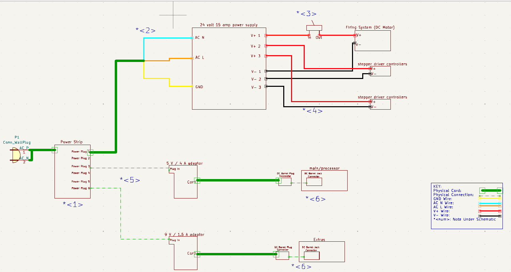

# Device Power Subsystem

**Function:**

Figure 1: Device Power Subsystem

The goal of this subsystem is to convert AC power from the wall outlet to DC power, and then distribute that power to the different device systems.  

**Constraints:**

| NO. | Constraint                                                          | Origin           |
|-----|---------------------------------------------------------------------|------------------|
| 1   | The power system shall be controlled by an emergency stop which will de-energize the mechanical system. This will shut off the motors which will not allow any projectiles to be fired. This will only be used if the system threatens peoples safety |Conceptual Design |
| 2   | The system shall convert 100-120 wall outlet AC voltage to 20 watts, which is required by the main/processor unit, 4.5 watts, which is required by the extra subsytem and a minimum of 312 Watts DC, which is required by the mechanical unit |Conceptual Design |
| 3   | The system shall be controlled by a power switch                 |Conceptual Design |

1 The power system shall be controlled by an emergency stop which will de-energize the mechanical system. This will shut off the motors which will not allow any projectiles to be fired. This will only be used if the system threatens peoples safety  [Conceptual Design]

One of the requirements in the rulebook, given to us by the customer, is that the interceptor needs to have an emergency stop that de-energizes the interceptor. This emergency stop will cut power from the AC-DC convertor for the mechanical system to the motors themselves which will de-energize the interceptor. This system will only be used as a last case option if the interceptor threatens peoples safety. 

2 The system shall convert 100-120 wall outlet AC voltage to 20 watts, which is required by the main/processor unit, 4.5 watts, which is required by the extra subsystem and a minimum of 312 Watts DC, which is required by the mechanical unit [Conceptual Design]

The overall system must be able to provide a total of 336.5 watts. The processor of this system requires a power draw of 20 watts and will be powered by its on supply. The extra system requires a power draw of 4.5 watts and will be powered by its on supply. The mechanical unit will consist of one DC motor that will do the firing and two motor controllers that will operate on the aiming system. The total combined power draw of this system is at least 312 watts. 

3  The system shall be controlled by a power switch  [Conceptual Design]

The system will be controlled by an on/off switch. This switch will allow the wall power to be connected or disconnected from each system that this subsystem powers.  

## Buildable schematic 

*power subsystem buildable schematic*

### Schematic Notes

1. Each power plug will have its own power switch. This will allow each power supply to be easily turned on or turned off.
2. The cord that will be used to connect the power strip and the 24 volt 15 amp supply will need to have the plugin removed to allow access to the ground wire, AC neutral wire (AC N) and AC line wire (AC L). These wires will be connected to the power supply.
3. This switch will act as the emergency switch between the power supply and the firing motors. Only the postive voltage wire will be connected to the switch. This will allow the circuit to become a complete loop between the supply, postive voltage wire, negative voltage wire and actual motor when the switch is closed.
4. The red and black wires are the postive voltage (red) and negative voltage (black) connections.
5. These adaptors are physically connected to the power strip. There is no cord between them, these will be plugged straight in.
6. The barrel plug connectors will be physically plugged into the barrel jack connectors. The barrel jack connectors are physically soldered on the Jetson Nano board and Ardunio board.

## Analysis

| System        | Voltage    | Current   | Power       | 
|---------------|------------|-----------|-------------|
| Mechanical    | 24 Volts   | 13 Amps  | 312 Watts    |
| Extra | 9 Volts  | 500 mAmps | 4.5 Watts  |
| Processor     | 5 Volts    | 4 Amps    | 20 Watts    |
| Total         |  |     | 336.5 Watts |

The above table details the different power draws that is required from this system. 

### Mechanical:

This power system will supply power to three main componets of the mechanical system. These componets are the firing mechanism's DC motor, and two stepper driver controllers that will control the aiming of the interceptor. The DC motor has voltage requirement of 24 volts with an amperage draw of 10 amps. This means the power draw of this system will be:

DC Motor Power Draw: (24 volts) * (10 amps) = 240 watts

The two stepper driver controllers have a voltage requirment of 24 volts with an amprage draw of 1.5 amps. This means the total power draw of both controllers will be:

Single Controller Power Draw: (24 volts) * (1.5 amps) = 36 watts

Total Controller Power Draw: (36 watts) + (36 watts) = 72 watts

This places the maximum power draw of the entire system at:

Total Power draw of the Mechanical System: (240 watts) + (72 watts) = 312 watts

To acomplish the total power draw required, this system will utilize a power supply capable of supplying 360 watts of power. This will give the system plenty of freedom as there will be an excess of 48 watts [4].

### Extra:

The extra system will be controlled by an Ardunio Uno R3. This Ardunio has a voltage requirement of 9 volts and a minimum amperage draw of 0.5 amps. This means the total power draw of this system will be:

Total Power draw of the Extra System: (9 volts) * (0.5 amps) = 4.5 watts

The buildable schematic shows this system will supply a 9 volt signal at 1.5 amps rather than 0.5 amps. This is becuase the Adaptor choosen [1] is built for this specfic Ardunio and the Ardunio itself is able to limit the current draw from this adaptor to the acceptable current load. 

### Processor:
The processor system will be controlled by a Jetson Nano developer kit. This Jetson Nano requires a voltage of 5 volts and an amperage draw of 4 amps. The total power draw of this system will then be:

(5 volts) * (4 amps) = 20 watts

To acomplish this power draw, the system will utilize an adaptor that was designed for this specfic Jetson Nano [2]. This adaptor supplys a voltage of 5 volts and a maximum current of 4 amps [2]. 

### Total Power

To achieve everything this system is required to do, the total power draw of this system will be:

(312 watts) + (4.5 watts) + (20 watts) = 336.5 watts

This will be accomplished by using three seperate power supplies. The first will supply a total of 360 watts and will power the Mechanical system [4]. The second will supply a total of 13.5 watts and will power the extra system [1]. The final adaptor will supply 20 watts and will power the processor system [2]. The total power draw of these three supplies will be:

(360 watts) + (13.5 watts) + (20 watts) = 393.5 watts

The total supplied power of 393.5 watts will completely encapsulate the required wattage of 336.5 watts, and will allow the system to function correctly and accurately.

### Power Switch 

To accomplish the power switch constraint this system will utilize a power strip. This power strip will have six seperate plug ins each with it's own power switch. This system will utilize three of the six plugs as there are three power supplies being used in this system. The power strip selected is rated for 1875 watts of power which will comfortably encapsulate the three supplies being utilzed as the maximum power draw for this system is 336.5 watts. [3]

### Emergency Stop

To accomplish the emergency stop contsraint this system will connect the DC motor power input to a switch that will effectively cut the power to the motor. This will stop the interceptor from firing any projectiles. The switch that will be 
utilized for this system is rated for a maximum of 30 volts and a DC current maximum of 20 amps. The DC motors will receive 24 volts at 10 amps. The voltage and current rating of the switch will be more than enough to support what the motor requires to funtion. [5]

## BOM
|Item Name | Description | Subsystems | Part Number | Manufacturer | Quantity | Price | Total |
|----------|-------------|------------|-------------|--------------|----------|-------|-------|
|CCCEI Metal Power Strip Individual Switches 6 Outlets | 6 plugin power strip with 6 switches | Mechanical, Extra, Processor | B08HYLW3GX | CCCEI | 1 | 16.99 | 16.99 |
|Emergency stop switch | Switch rated for 30 volts and 20 amps | Mechanical | 360-1887-ND | NKK Switches | 1 | 7.03 | 24.02 |
|5V 4A Power Supply Adapter | Jetson Nano power supply rated for 5 volts and 4 amps | Processor | B07RTWD725 | COOLM | 1 | 13.68 | 37.70 |
|Gonine 9V DC Power Supply | Arduino Uno R3 power supply rated for 9 volts and 1.5 amps | Extra | B099J3JCVX | wei dian | 1 | 12.69 | 50.39 |
|ALITOVE DC 24V 15A 360W Power Supply | 360 watt power supply | Mechanical | B06XK2ZNKC | ALITOVE | 1 | 23.99 | 74.38 |
|16 AWG wire | 16 AWG wire to hook up mechanical system | Mechanical | B07D73ZRDP | GS Power | 1 | 8.49 | 82.87 |
|AC power cord | Power cord that will connect the power strip and Mechanical power supply | Mechanical | B09VRLJD7J | LORDTRONICS | 1 | 6.99 | 89.86 |

## References 

[1] Amazon, https://www.amazon.com/Gonine-5-5x2-1mm-Positive-Connector-Elliptical/dp/B099J3JCVX/ref=sr_1_1_sspa?crid=PDOUNUYWJ2B9&dib=eyJ2IjoiMSJ9.DJoK0_iOF_aAvsQ3QTa63W7iStx7BwVycj7Q1kl-PXtBLvlEaBwqgG6gtWA8PbD0Pj3ScHu33EI9rB3q83JOwQOaTEeChCkqDVHIeSJvLMLoOfzRVe8galg447OFLraCADJLGRl8nRRVqM07tapisdxicN7Ti7NdJ2gpvM41qR_SDix9Tqm8iRB4G1L3mphy0nhB-nHj8vJP2KhA4ZPjADA87iALTsqvwnnskK2TbH3c4f8Ec2eN8c0EF80YXXX3q1geBsunN407VK1EZmhQxqc_HNy_UdLM57_ruaM_QUg.E6YjSVNYmqFjQegxH1kKLQZPtozE0ootNyhxLe2Ou2c&dib_tag=se&keywords=arduino+uno+r3+power+supply&qid=1713303820&s=electronics&sprefix=arduino+uno+r3+power+supply%2Celectronics%2C90&sr=1-1-spons&sp_csd=d2lkZ2V0TmFtZT1zcF9hdGY&psc=1 (accessed Apr. 16, 2024). 

[2] Amazon, https://www.amazon.com/5V-Power-Supply-Adapter-Universal/dp/B07RTWD725/ref=sr_1_1_sspa?crid=1OU1EJ4H7X9BT&dib=eyJ2IjoiMSJ9.sXmGimoCjSyPLAbJTSi1qaMPM7xYBu2pLDlTtzcteTO3oDI0TMAshqyQnxJYDEYHpUoCurrPArHwJW7kO2ipm9MmgS-NAF6OLQj48GTgYJYLTzAsKkSoX_MnvI4mQLLxzvl9vu_BY5mQ-JXqkI16cp6DiZRwXpRfrVIF96KMxyoA18KmddLYUZkxDVNXNKaUJaJo8UFwV7_Y1RUX_TlRKzGKPTkZSGDgxEZnbJcxl5svoI44vs7zIEWi-fPMpM7McsCO2mVNEIpRqAixbON8vHwa2b4EJ4yywpdkxMSQAjk.qAJk2VW_ASJKmJ1jde06lwT246mCHOzZ5rIuJDCZgWo&dib_tag=se&keywords=jetson%2Bnano%2Bpower%2Bsupply%2B5v%2B4a&qid=1713303744&s=electronics&sprefix=jetson%2Bnano%2Bpower%2Celectronics%2C82&sr=1-1-spons&sp_csd=d2lkZ2V0TmFtZT1zcF9hdGY&th=1 (accessed Apr. 16, 2024).  

[3] Amazon, https://www.amazon.com/Individual-Switches-Protector-Appliances-Extension/dp/B08HYLW3GX/ref=asc_df_B08HYLW3GX/?tag=hyprod-20&linkCode=df0&hvadid=647192999967&hvpos=&hvnetw=g&hvrand=12971397952727350175&hvpone=&hvptwo=&hvqmt=&hvdev=c&hvdvcmdl=&hvlocint=&hvlocphy=1025954&hvtargid=pla-2013978108223&mcid=3f30a49c0078360ebf82f79cd802428d&th=1 (accessed Apr. 16, 2024). 

[4] Amazon, https://www.amazon.com/ALITOVE-Universal-Regulated-Switching-Transformer/dp/B06XK2ZNKC/ref=asc_df_B06XK2ZNKC/?tag=hyprod-20&linkCode=df0&hvadid=241935719665&hvpos=&hvnetw=g&hvrand=6310000027683861751&hvpone=&hvptwo=&hvqmt=&hvdev=c&hvdvcmdl=&hvlocint=&hvlocphy=1025954&hvtargid=pla-401426217092&mcid=324cb35da40333b298d63ebf99c464f1&gclid=CjwKCAjwz42xBhB9EiwA48pT786SSbMxG2WTaF_n8CQgsneQMYSm_EulaxHUTGMk5KMV0CFH-mvGDhoCHmgQAvD_BwE&th=1 (accessed Apr. 20, 2024). 

[5] S1F NKK switches - digikey, https://www.digikey.com/en/products/detail/nkk-switches/S1F/1006965 (accessed Apr. 20, 2024). 

[6] Amazon, https://www.amazon.com/American-Aluminum-Primary-Amplifier-Available/dp/B07D73ZRDP/ref=sr_1_2_sspa?crid=H80LENUU6197&dib=eyJ2IjoiMSJ9.0LnrB1pSbZfctUIBZoggXpFtF6rNKA5WSjlZ1BAxa5VLNFYzVeSdHbTsxIQpBpOHzXC3YJbnzAa_KSkYleJmfalTRC9e7IBhriGkN5cIdJByBwJBxLefuZR3uARHY3WuPzhVAXu12tEcI4Wv8BbEOHL121_mpBof-J1BaaBkTpbt3_WxFslTWzDCWcemV1DMtBLuySWdO_Ky-T0tlHlHxXulC8i8DlvqhMharC0pRcQ-3uMR8DgiFz2wJZ-PH6kPn4uHzeBoAxzH3pkFlQdPqg6ym2pBhJvBym3UzcEjujM.eUjEa-tsRWWr0zni-ns4wD1nVYVzsPe6mKV8hno2oPM&dib_tag=se&keywords=16%2Bawg%2Bwire&qid=1713650740&refinements=p_36%3A-1000&rnid=1243644011&sprefix=16%2Bawg%2B%2Caps%2C90&sr=8-2-spons&sp_csd=d2lkZ2V0TmFtZT1zcF9hdGY&th=1 (accessed Apr. 20, 2024). 

[7] Digikey, https://mm.digikey.com/Volume0/opasdata/d220001/medias/docus/13/451,452_Series_Header&Socket.pdf (accessed Apr. 20, 2024). 

[8] Amazon, https://www.amazon.com/Standard-Electronics-Computer-Printer-Monitor/dp/B09VRLJD7J/ref=asc_df_B09VRLJD7J/?tag=hyprod-20&linkCode=df0&hvadid=563656015384&hvpos=&hvnetw=g&hvrand=18295324020142779198&hvpone=&hvptwo=&hvqmt=&hvdev=c&hvdvcmdl=&hvlocint=&hvlocphy=1025954&hvtargid=pla-1674555517194&psc=1&mcid=45cb6e5d55683eab850fcc240ea659f4&gclid=Cj0KCQjw8pKxBhD_ARIsAPrG45l9_eElMxkK2B0lfPSFFqoQLkjJyrHErvuGgWtmSExOTyspiT-g-f4aAjSZEALw_wcB (accessed Apr. 21, 2024). 
