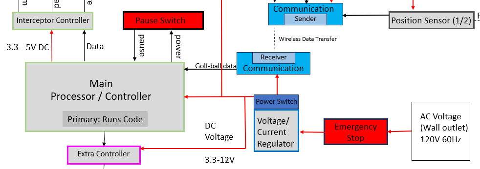

# Emergency Stop and Pause

Figure 1: Emergency Stop and Pause sub-system, seen here as the color red.

- The goal of this subsystem is to adhere to the rules as provided by the customer, Devcom. The system needs a pause switch to deactivate it between rounds and the emergency stop will be used to deenergize the system.

## **Constraints:**

| **Number:** | **Constraint:** | **Origin:** | 
| --- | --- | --- |
| 1. | The interceptor needs to have an E-stop that deenergizes the interceptor. | Rulebook |
| 2. | The interceptor needs a switch that sets the system into a pause state.  | Rulebook |
| 3. | --- | --- |
| 4. | --- | --- |

1. One of the requirements in the rulebook, given to us by the customer, is that the interceptor needs to have an emergency stop that deenergizes the interceptor. This will be needed to ensure that the design passes the safety check.
   
2. One of the requirements in the rulebook, given to us by the customer, is that the interceptor needs to have a pause switch that keeps the interceptor from firing when the board is being reset. This switch will need to be physical, but in the implementation, it will run to the processor where it will prevent it from outputting any signals.
   
3.

## **Analysis**

## Bill of Materials

| **Items:** | **Quantity:** | **Price:** | **Total:** |
| --- | --- | --- | --- |
