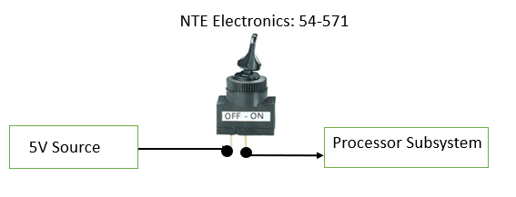

# Emergency Stop and Pause

Figure 1: Emergency Stop and Pause sub-system, seen here as the color red.

- The goal of this subsystem is to adhere to the rules as provided by the customer, Devcom. The system needs a pause switch to deactivate it between rounds and the emergency stop will be used to deenergize the system if a problem occurs.

## **Constraints:**

| **Number:** | **Constraint:** | **Origin:** | 
| --- | --- | --- |
| 1. | The interceptor shall have an E-stop that de-energizes the interceptor. | Rulebook |
| 2. | The interceptor shall have a switch that sets the system into a pause state.  | Rulebook |
| 3. | The voltage switched by the pause switch shall be within the requirements of the processor block. | System Constraint|

1. One of the requirements in the rulebook, given to us by the customer, is that the interceptor needs to have an emergency stop that de-energizes the interceptor. This will be needed to ensure that the design passes the safety check.
   
2. One of the requirements in the rulebook, given to us by the customer, is that the interceptor needs to have a pause switch that keeps the interceptor from firing when the board is being reset. This switch will need to be physical, but in the implementation, it will run to the processor where it will prevent it from outputting any signals.
   
3. The circuit that is implemented by the pause switch needs to fall within the limitations of the processor block. This will most likely be 5V which will most likely be provided by the processor block. That being said, this number may change depending on the processor chosen.

## **Analysis**
For the pause switch component, there are many different switches that can be chosen. Switches range between single pole single throw and upwards. The switch that needs to be implemented for the pause switch should be a single pole single-throw switch that has a single on and off function. This will ensure that with one connection the processor will be receiving 5V, which will count as a binary one, and when the switch is off the processor will not be connected which will be interpreted as a binary zero. The switch that was chosen for this task is the NTE Electronics, 54-571. This switch is rated for 20A and 12VDC which will be more than enough for this simple task. The other main portion of the pause switch is the implementation in the code of the processor. Because a processor has not been chosen now it is not possible to say exactly how this will be implemented, but pseudocode can be written to make the coding process easier. To be clear when the pause switch is on 5V or equivalent will be allowed to pass and when it is off the circuit will not be connected. This input will be interpreted as a variable and when the circuit is on the processor will be allowed to collect the data from the sensors. When the switch is off the processor will be in the pause state where it can not do anything but wait for the switch to be turned on.

The emergency stop is a constraint that was added by the customer, Devcom. This switch has one purpose and that is to de-energize the system. The thought was this could easily be done by cutting off the power directly at the source. This can be done with the PRIME 3-Outlet Extension Cord with Lighted Footswitch. This extension cord is rated for 13A and 125V which will be more than enough for the power that needs to be supplied to the power subsystem. The main selling point of this item is that it includes two LEDs that indicate when the power is on and off. Based on the description the foot switch displays red when the power is off and green when the power is on. This will be perfect for the team’s application because it will be very easy to identify when the power is on and off. 

## Buildable Schematic

Figure 2: The 5V source will most likely come from an output of the processor block but if this is not possible it may have to come from the power block. Either way, the switch will go into the processor block. 

Figure 3: The image shows the connections of the Prime extension cord and the connections that will be made. The circle in the middle represents the foot switch which includes the LEDs to indicate if the power is on or off. 

## Bill of Materials

| **Items:** | **Quantity:** | **Price:** | **Total:** |
| --- | --- | --- | --- |
| NTE Electronics, 54-571 | 1 | $3.48 | $3.48 |
| PRIME Extension Cord | 1 | $6.98 | $10.46 |

## References
1. [1] “Toggle switches,” NTE Electronics, https://www.nteinc.com/switches/pdf/toggle-std.pdf (accessed Apr. 6, 2024).

2. [2] “9FT 16/2 SPT-2 Green 3-Outlet Extension Cord W/Lighted Footswitch,” Prime Wire & Cable Inc., https://primewirecable.com/products/fsl7806099ft-16-2-spt-2-green-3-outlet-extension-cord-w-lighted-footswitch?_pos=1&_sid=f6715f7aa&_ss=r (accessed Apr. 6, 2024). 
‌
