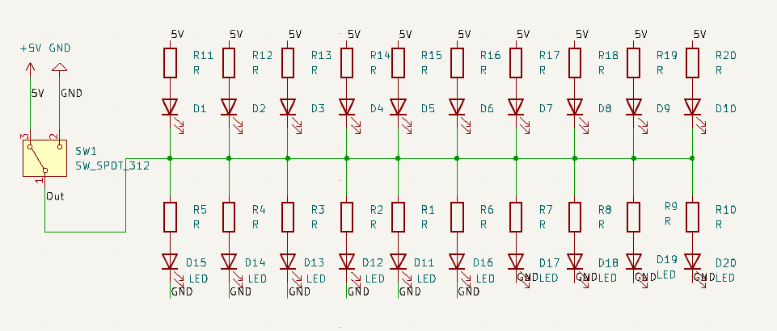
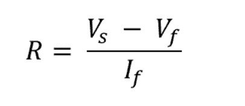

# Extra

Figure 1: Extra subsystem and the pause switch can be seen in this figure.

- The goal of this subsystem is to adhere to the rules as provided by the customer, Devcom, and to add lights and sounds to the design which will add to the point total as provided by Devcom. The system needs a pause switch to deactivate it between rounds. The system will also include lights and sounds before launching a projectile to add to the decoration portion of the design.

## **Constraints:**

| **Number:** | **Constraint:** | **Origin:** | 
| --- | --- | --- |
| 1. |  The interceptor shall have a switch that sets the system into a pause state that will keep the interceptor from firing. | Rulebook |
| 2. | The voltage switched by the pause switch shall be 5V. | System Constraint|
| 3. | The interceptor must have lights that are bright enough to be seen by the judges approximately six and a half feet away, which is the longest length of the gameboard. These lights must also be powered by the arduino and must emit a light that falls within the visual light spectrum of 380 to 720 nanometers [1]. | Rulebook / System |
| 4. | The interceptor must make sounds before firing. The sounds will need to fall within the range of frequency humans can hear which is 20 to 20,000Hz [2]. The volume, or loudness, must fall within a range of 30-50 dB, which is the average noise of a room [2], to a maximum of 120dB and must not exceed 85dB for more than eight hours or it may cause hearing damage [2]. | Rulebook / Safety |
   
1. One of the requirements in the rulebook, given to us by the customer, is that the interceptor needs to have a pause switch that keeps the interceptor from firing when the board is being reset. This switch will need to be physical, but in the implementation, it will run to the processor where it will prevent it from outputting any signals. When the switch is engaged it will keep the processor block from outputting signals to the mechanical system. This will ensure that the interceptor does not fire while the judges are in the competition area.
   
2. The circuit that is implemented by the pause switch needs to fall within the limitations of the processor block. Based on the processors that could be chosen the voltage that will be switched will be 5V. This source will be connected to a PCB that will be connecting the circuit components.

3. To add to the total points for the competition, the interceptor must have lights. This constraint can be found in the official rulebook for the competition. Any amount of visual light, which falls within 380 to 720 nanometers [1], is sufficient to count for the constraint. Therefore two arrays of ten LED's will be used for this. These LED's must be able to be powered by a 5V source that comes from the chosen arduino for the buzzer. These LED’s emit light with a wavelength of 565nm for the green LED and 617nm for the red LED. This is with 10mA of current and in the current setup 20mA are being supplied which is more than enough to show these lights will be visible.
   
4. To add to the total points for the competition, the interceptor must make sounds before firing. This constraint can be found in the official rulebook for the competition. The piezo buzzer must be able to work with an output of the Arduino Uno R3 which will be 5V. It must also fall within the human hearing range of frequency which is 20 to approximately 20,000Hz. The piezo buzzer that was chosen operates at a frequency of 3600Hz to 4600Hz which will fall within the frequency range that we can hear. When it comes to loudness, humans can tolerate a range of 0 to 120db and the sound must not exceed 85db for long periods which will keep the noise at a save level [2]. The buzzer that has been chosen operates from 3 to 16 VDC and operates at a minimum of 70db at 12V therefore at the voltage that is being used, the sounds will be at a safe level for the small periods of time that they will be used. 
   
## Buildable Schematic

Figure 1: This represents the buildable schematic for the pause switch. This switch outputs 5V or ground that is found on the arduino. This output is sent to the processor block to determine the pause state. In this example, the green LED's will be at the top, and the red LED's will be at the bottom.

Figure 2: This image shows the buildable schematic for the buzzer system. This buzzer is powered by an Arduino Uno R3 that takes a power input from the device power system of 9V and an input from the processor to tell the arduino when to play the sounds. Finally, it outputs 5V for the buzzer to play the sound.

## **Analysis**
For the pause switch component, there are many different switches that can be chosen. Switches range between single pole single throw and upwards. The switch that needs to be implemented for the pause switch should be a single pole double-throw switch that has a two on functions and an off function. This will ensure that with one connection the processor will be receiving 5V, which will count as a binary one, and when the switch is off the processor will be connected to ground which will be interpreted as a binary zero. 5V has been chosen as the voltage because all of the processors that will possibly be chosen have a 5V output. The switch that was chosen for this task is the CIT Relay and Switch, ANT11SF1CQE [3]. This switch is rated for 5A and 28VDC which will be more than enough for this simple task. The other main portion of the pause switch is the implementation in the code of the processor. Because a processor has not been chosen now it is not possible to say exactly how this will be implemented, but pseudocode can be written to make the coding process easier. To be clear when the pause switch is on 5V or equivalent will be allowed to pass and when it is off the circuit will not be connected. This input will be interpreted as a variable and when the circuit is on the processor will be allowed to collect the data from the sensors. When the switch is off the processor will be in the pause state where it can not do anything but wait for the switch to be turned on. 

When the output of the switch is connected to 5V this will be sent to the processor and an array of ten red LED's, with a light of 624nm, [4] and ten current limiting resistors that will indicate that the interceptor has been put into pause mode. This set of LED's will be connected to the processor node on one side and the gound on the other. This will allow current to flow when the switch is connected to 5V. The array of ten green LED's, with a light of 525nm, [5] will be connected to the processor node on one side and 5V on the other. When the switch is connected to the ground current will flow from the 5V to the ground which will light up the green LED's. This will serve to show that the interceptor is in the pause state.

 [6]

The maximum current that can be handled by the LED's is 30mA for the green LED's and for the red it is 50mA. Because of the 5V being used a resistor value was chosen, using the equation above [6], to keep the LED's below their maximum ratings. Both resistors share the same Vs of 5V. The values for the red LED were found using the datasheet those values are: Vf = max of 3.0V and If DC = max of 50mA [7]. For the green LED's the datasheet was used to find values of Vf = 3.6V max and If DC = 30mA max [8]. These values were then put into the equation above and resistance values were calculated to make both resistors. The green LED's need a resistance of 75 Ohm [9] and the red LED's need a resistance of 50 Ohm [10]. For the green LED this sets the voltage at 3.5V and the current at 20mA. This allows for the light intensity to be calculated from the datasheet, at 20mA the LED is rated for 25cd [8]. For the red LED, the values are set at 2.5V and 50mA. Based on the datasheet, a current of 50mA produces a value of 25cd [7]. This sets the power consumtion at 0.125W for the red LED and 0.03W for the green LED, according to the first equation below.

$$P=VI$$

Using the candela to lumen calculator [11], the value of 25cd that these lights are rated for and the viewing angle which is 30 degrees for the green LED [8] and 18 degrees for the red LED [7] is used. The values are taken in and the lumen value for the green LED is 5.352 lumens and for the red LED it is 1.934 lumens. Using superposition and the fact that there are 10 LED's per color the new lumen values would be 53.52 lumens for the green LED's and 19.34 lumens for the red LED's. This value can then be converted to foot candles at 6.5ft using the following equation [12]. At 6.5ft the foot candle values will be 5.352 divided by 42.25 which would be 1.267 fcd for the green LED's and 0.458 fcd for the red LED's. According to the footcandle light guide [13], a foot candle value of 0.3 is recommended for a suburban parking lot, the values of these LED's is greater than this value. Therefore the LED's foot candle values will be enough to be seen by the judges at the size of the gameboard, which is 6.5ft.

$$1 fcd = 1 lm/ft²$$

The interceptor sound controller will be an Arduino Uno r3 [13] and it will be making a sound using a piezo buzzer. The Arduino r3 was chosen because of its ease of use and the availability of open-source code and documentation. The schematic can be seen in figure two. The wiring diagram is very simple and only involves a few connections. The first connection would be from the GPIO (General Purpose Input Output) pins to the positive connection of the buzzer and then the ground would be connected to the ground of the board. All that would be left is the code for making the sounds. The code written would need to generate a sound that is tolerable and falls within the frequency requirements of the piezo buzzer. This sound would be played for a defined period of time when the processor sends the proper signal. The buzzer that was chosen is the KINGSTATE KPEG242 [14]. This buzzer is rated for 3V to 16V DC and a frequency of 3600Hz to 4600Hz. This means that the output of the Arduino should not exceed 16V and 4600Hz to ensure that the buzzer is operating properly. This buzzer is also rated for a minimum of 70db which means that it should only be used for small intervals. 

## Bill of Materials

| **Items:** | **Quantity:** | **Price:** | **Total:** |
| --- | --- | --- | --- |
| CIT Relay and Switch, ANT11SF1CQE (Switch) | 1 | $3.48 | $3.48 |
|  Vishay Semiconductor Opto Division, VLCS5130 (Red LED) | 10 | $4.10 | $7.58 |
|  American Bright Optoelectronics Corporation, BL-BGX3V1 (Green LED) | 10 | $3.47 | $11.05 |
|  Stackpole Electronics Inc, RNF18FTD75R0 (75 Ohm Resistor) | 10 | $0.87 | $11.92 |
|  Vishay Dale, CMF5550R000FKEK70 (50 Ohm resistor) | 10 | $3.78 | $15.70 |
| Arduino Uno REV3 [A000066] (Arduino) | 1 | $27.60 | $43.30 |
| KINGSTATE KPEG242 (Buzzer) | 1 | $2.13 | $45.43 |

| **Item:** | **URL** |
| --- | --- |
| CIT Relay and Switch, ANT11SF1CQE (Switch) |  https://www.digikey.com/en/products/detail/cit-relay-and-switch/ANT11SF1CQE/12503396 |
| Vishay Semiconductor Opto Division, VLCS5130 (Red LED) | https://www.digikey.com/en/products/detail/vishay-semiconductor-opto-division/VLCS5130/4073547 |
| American Bright Optoelectronics Corporation, BL-BGX3V1 (Green LED) | https://www.digikey.com/en/products/detail/american-bright-optoelectronics-corporation/BL-BGX3V1/9678159 |
|  Stackpole Electronics Inc, RNF18FTD75R0 (75 Ohm Resistor) | https://www.digikey.com/en/products/detail/stackpole-electronics-inc/RNF18FTD75R0/1682997 |
| Vishay Dale, CMF5550R000FKEK70 (50 Ohm Resistor) | https://www.digikey.com/en/products/detail/vishay-dale/CMF5550R000FKEK70/3616606 |
| Arduino Uno REV3 [A000066] (Arduino) | https://www.amazon.com/Arduino-A000066-ARDUINO-UNO-R3/dp/B008GRTSV6/ref=asc_df_B008GRTSV6?tag=bngsmtphsnus-20&linkCode=df0&hvadid=79852149837934&hvnetw=s&hvqmt=ehvbmt=be&hvdev=c&hvlocint=&hvlocphy=&hvtargid=pla-4583451676566041&th=1 |
| KINGSTATE KPEG242 (Buzzer) | https://www.newark.com/kingstate/kpeg242/piezo-buzzer-4-1khz-70db/dp/61M7049?mckv=s_dc|pcrid||plid||kword||match|e|slid||product|61M7049|pgrid|1231453304461926|ptaid|pla-4580565455222458|&msclkid=4ff6ddb1429613a4db67bb914883a843&CMP=KNC-BUSA-GEN-Shopping-ALL |

## References
1. A. Hadhazy, “What are the limits of human vision?,” BBC News, https://www.bbc.com/future/article/20150727-what-are-the-limits-of-human-vision (accessed Apr. 17, 2024). 
2. “What is the human hearing range in hz and DB?: Miracle-ear,” Miracle Ear, https://www.miracle-ear.com/blog-news/human-hearing-range (accessed Apr. 17, 2024). 
3. “Ant11sf1cqe CIT relay and switch | switches | DigiKey,” Digikey, https://www.digikey.com/en/products/detail/cit-relay-and-switch/ANT11SF1CQE/12503396 (accessed Apr. 16, 2024). 
4. “VLCS5130,” DigiKey, https://www.digikey.com/en/products/detail/vishay-semiconductor-opto-division/VLCS5130/4073547 (accessed Apr. 21, 2024).
5. “BL-BGX3V1,” DigiKey, https://www.digikey.com/en/products/detail/american-bright-optoelectronics-corporation/BL-BGX3V1/9678159 (accessed Apr. 21, 2024). 
6. V. Lynch, “Led resistor calculator,” The Engineering Mindset, https://theengineeringmindset.com/led-resistor-calculator/ (accessed Apr. 21, 2024). 
7. “VLCS5130,” Vishay, https://www.vishay.com/docs/81938/vlcs5130.pdf (accessed Apr. 21, 2024). 
8. “BL-BGX3V1,” BRIGHT LED ElLECTRONICS CORP., https://www.americanbrightled.com/pdffiles/led-components/through-hole/BL-BGX3V1.pdf (accessed Apr. 21, 2024). 
9. “RNF18FTD75R0,” DigiKey, https://www.digikey.com/en/products/detail/stackpole-electronics-inc/RNF18FTD75R0/1682997 (accessed Apr. 21, 2024). 
10. “CMF5550R000FKEK70,” DigiKey, https://www.digikey.com/en/products/detail/vishay-dale/CMF5550R000FKEK70/3616606 (accessed Apr. 21, 2024).
11. “Candela (millicandela) to Lumen Conversion Wizard,” CommercialLEDLights.com, https://commercialledlights.com/candela-lumen-conversion-calculator (accessed Apr. 21, 2024).
12. “Lumens vs Footcandles : What’s the Difference?,” quickandeasylighting.com, https://quickandeasylighting.com/lumens-vs-footcandles/ (accessed Apr. 21, 2024).
13. “FOOTCANDLE LIGHT GUIDE,” lightingdesignlab.com, https://www.lightingdesignlab.com/sites/default/files/pdf/Footcandle_Lighting%20Guide_Rev.072013.pdf (accessed Apr. 21, 2024). 
14. “A000066-datasheet.pdf,” Ardui Uno R3, https://docs.arduino.cc/resources/datasheets/A000066-datasheet.pdf (accessed Apr. 16, 2024). 
15. “KPEG242 - Transducer, Piezo, buzzer, audio indicator, continuous, 3 V, 16 V, 7 ma, 70 DB,” Newark, https://www.newark.com/kingstate/kpeg242/piezo-buzzer-4-1khz-70db/dp/61M7049?mckv=s_dc%7Cpcrid%7C%7Cplid%7C%7Ckword%7C%7Cmatch%7Ce%7Cslid%7C%7Cproduct%7C61M7049%7Cpgrid%7C1231453304461926%7Cptaid%7Cpla-4580565455222458%7C&msclkid=4ff6ddb1429613a4db67bb914883a843&CMP=KNC-BUSA-GEN-Shopping-ALL (accessed Apr. 17, 2024).

‌
