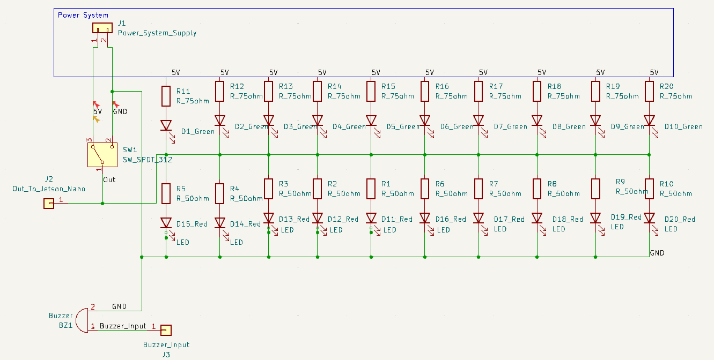

# Extra

Figure 1: Extra subsystem and the pause switch can be seen in this figure. The resistor values will be 250 Ohm.

- The goal of this subsystem is to adhere to the rules as provided by the customer, Devcom, and to add lights and sounds to the design which will add to the point total as provided by Devcom. The system needs a pause switch to deactivate it between rounds. The system will also include lights and sounds before launching a projectile to add to the decoration portion of the design.
## **Constraints:**

| **Number:** | **Constraint:** | **Origin:** | 
| --- | --- | --- |
| 1. |  The interceptor shall have a switch that sets the system into a pause state that will keep the interceptor from firing. | Rulebook |
| 2. | The voltage switched by the pause switch shall be 5V. | System Constraint|
| 3. | The interceptor must have lights. These lights must be powered by a 5V source from the processor block. | Rulebook |
| 4. | The interceptor must make sounds before firing. The sounds will be powered by a Arduino uno r3 that has an output voltage of 5V. | Rulebook |
   
1. One of the requirements in the rulebook, given to us by the customer, is that the interceptor needs to have a pause switch that keeps the interceptor from firing when the board is being reset. This switch will need to be physical, but in the implementation, it will run to the processor where it will prevent it from outputting any signals. When the switch is engaged it will keep the processor block from outputting signals to the mechanical system. This will ensure that the interceptor does not fire while the judges are in the competition area.
   
2. The circuit that is implemented by the pause switch needs to fall within the limitations of the processor block. Based on the processors that could be chosen the voltage that will be switched will be 5V.

3. To add to the total points for the competition, the interceptor must have lights. This constraint can be found in the official rulebook for the competition. Any amount of lights is sufficient to count for the constraint. Therefore two arrays of ten LED's will be used for this. These LED's must be able to be powered by a 5V source that comes from the processor block. 
4. To add to the total points for the competition, the interceptor must make sounds before firing. This constraint can be found in the official rulebook for the competition. The piezo buzzer must be able to work with an output of the Arduino Uno R3 which will be 5V. 
   
## Buildable Schematic

Figure 1: This represents the buildable schematic for the pause switch. This switch outputs 5V or ground that is sent to the processor block and the LED array. The 5V and ground will both come from the processor block. In this example, the red LED's will be at the top, and the green LED's will be at the bottom.

## **Analysis**
For the pause switch component, there are many different switches that can be chosen. Switches range between single pole single throw and upwards. The switch that needs to be implemented for the pause switch should be a single pole double-throw switch that has a two on functions and an off function. This will ensure that with one connection the processor will be receiving 5V, which will count as a binary one, and when the switch is off the processor will be connected to ground which will be interpreted as a binary zero. The switch that was chosen for this task is the CIT Relay and Switch, ANT11SF1CQE [1]. This switch is rated for 5A and 28VDC which will be more than enough for this simple task. The other main portion of the pause switch is the implementation in the code of the processor. Because a processor has not been chosen now it is not possible to say exactly how this will be implemented, but pseudocode can be written to make the coding process easier. To be clear when the pause switch is on 5V or equivalent will be allowed to pass and when it is off the circuit will not be connected. This input will be interpreted as a variable and when the circuit is on the processor will be allowed to collect the data from the sensors. When the switch is off the processor will be in the pause state where it can not do anything but wait for the switch to be turned on. When the output of the switch is connected to 5V this will be sent to the processor and an array of red LED's [2] and a current limiting resistor of 250Ohm [3] that will indicate that the interceptor has been put into pause mode. When the output of the switch is connected to ground then the output will be sent to the processor and an inverter, which is powered by the 5V source and a 250Ohm current limiting resistor. This inverter will then turn on the 250Ohm current limiting resistor which will then turn on an array of green LED's [6] to show that the interceptor is on and ready to fire.

$$V=IR$$

The maximum current that can be handled by the LED's is 25mA for the green LED's and for the red it is 30mA. Because of the 5V being used a resistor value was chosen that would keep the LED's within their ratings. Therefore, Ohm's Law shows that the current will be 5V divided by 250 Ohm's which will yield a current of 20mA of current which falls within the required maximums of 25mA and 30mA. The inverter has a maximum of 100mA of continuous current through Vcc or GND using the 250Ohm resistor means that a current of 20mA is calculated which will fall within the 100mA max.

The interceptor sound controller will be an Arduino Uno r3 [6] and it will be making a sound using a piezo buzzer. The Arduino r3 was chosen because of its ease of use and the availability of open-source code. The schematic can be seen in figure two. The wiring diagram is very simple and only involves a few connections. The first connection would be from the GPIO (General Purpose Input Output) pins to the positive connection of the buzzer and then the ground would be connected to the ground of the board. All that would be left is the code for making the sounds. The code written would need to generate a sound that is tolerable. This sound would be played when the processor sends the proper signal. This means that the sounds will play for a defined amount of time that will start when the processor gives the proper signal to the Arduino. The buzzer that was chosen is the CUI Devices CPI-137-83T piezo buzzer [7]. This buzzer is rated for 4V to 10V and a frequency of 3800Hz to 4800Hz. This means that the output of the Arduino should not exceed 10V and 4800Hz. 

## Bill of Materials

| **Items:** | **Quantity:** | **Price:** | **Total:** |
| --- | --- | --- | --- |
| CIT Relay and Switch, ANT11SF1CQE | 1 | $3.48 | $3.48 |
| Texas Instruments, CD74AC14E (Inverter) | 1 | $0.84 | $4.32 |
| SunLED, XLUG12D (Green LED) | 10 | $3.00 | $7.32 |
| Kingbright, WP7113ID (Red LED) | 10 | $3.40 | $10.72 |
| Ohmite, WHD250FET (250 Ohm Resistor) | 21 | $11.34 | $22.06 |
| Arduino Uno REV3 [A000066] | 1 | $27.60 | $49.66 |
| CUI Devices, CPI-137-83T | 1 | $1.71 | $51.37 |

## References
1. https://www.digikey.com/en/products/detail/cit-relay-and-switch/ANT11SF1CQE/12503396
2. https://www.digikey.com/en/products/detail/kingbright/WP7113ID/1747663
3. https://www.digikey.com/en/products/detail/texas-instruments/CD74AC14E/1691756
4. https://www.digikey.com/en/products/detail/sunled/XLUG12D/4745838
5. https://www.digikey.com/en/products/detail/ohmite/WHD250FET/16839029
6. https://docs.arduino.cc/resources/datasheets/A000066-datasheet.pdf
7. https://www.cuidevices.com/product/resource/cpi-137-83t.pdf
‌
