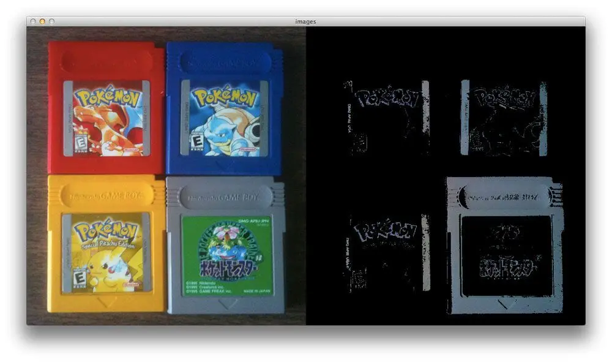
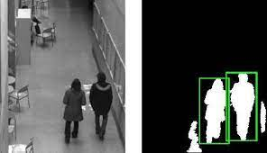
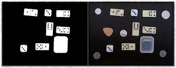

# Image Processing Subsystem

**Function:**

The goal of this subsystem is to receive and process the data from the camera sensor to determine the position and speed of the practice golf ball.  

**Constraints:**

| NO. | Constraint                                                          | Origin           |
|-----|---------------------------------------------------------------------|------------------|
| 1| Must be able to distinguish the golf ball from surroundings based on color| System Requirment|
| 2| Must be able to extract the coordinates of the golf ball from the image| System Requirment|
| 3| Must be able to perform calculations in 250 ms| System Requirment|

1. In order for the system to properly detect the golf ball and extract the necessary information for aiming, the system needs to distinguish the golf ball
from the rest of the image.
2. The program needs to use the coordinates from the camera to provide coordinates for aiming.
3. The fastest speed of the golf ball is 1.95 seconds from empirical data from the customer. The ball needs to be detected in enough time for the team to aim
   the launcher and launch the projectile. This minimum allows time for the motors to make adjustments and fire.

**Buildable Schematic**

The system is purely software. Any connections for the processor should be shown in that subsystems schematic.

**Analysis:**

The first issue is to detemine how the color of the object will be detected. Since the object is white, an HSV or hue, saturation, value scale will be used
to determine the color scheme of the picture. There is an algorithm that can be used for this avliable in coordination with OpenCV resources. The algorithm 
uses a function called inRange to determine and limit the colors being found. It takes in an image and the upper and lower limits of the color range. 
After this, a mask is established to search for the specific color being used using a bitwise and to detect the pixels with the color. Doing this for light
colors like grey result in detection shown in the figure below.

The level of color detection can be detemined by the number of pixels that are detected of a color using the upper and lower bounds. This can be adjusted to
detect the ball at longer distances when the pixels are smaller. The Big O analysis of this function would be O(n) because it is an iterative function that
will go through all of the pixels provided [1].

In order to ensure the object is detected, detecting the shape of the object will also be necessary. This can be done using blob detection which takes in
parameters to filter out objects based on size, shape, and contours. The golf ball can be detected using this since it should be the only spherical object in
the field of view. The result of using blob detection algorithms avliable in OpenCV can be seen below.

The level of detection can be adjusted as necessary to account for distance through experimentation. The Big O analysis for these algorithms are O(n) since
it is another iterative algorithm that looks at each pixel [2].

Next, the team needs to be able to determine the distance of the object. This can be done by coordinating the pixels of color detected from the image with 
the distance of those pixels measured by the camera. The depth value is provided in a matrix for each pixel. The color detection or blob dection used to
identify the object also goes through this array before determining which pixels are the object. The result of the mask for the pixels of the object will be
applied as a mask to the depth matrix. This will give the distance of the pixels repersenting the object and provide the distance of the object. This would
be O(n) because the number of pixels is still the only variable being used and affecting the processing time. These calculations would result in the final
information that is used for the processor to determine the signals being sent to the launcher.

Once the distance is obtained, a comparison can be made between a set object, like the sensor post, and the golf ball. This will obtain an x coordinate for
where the ball is located on the game board. This will be done by finding out how many pixels are between the ball and the sensor post. The team can then
use the number of pixels repersenting the sensor posts height and the actual height of the post to get a repersentation of height for each pixel. The pixels
between the golf ball and the ground or some other set point at a set height like the sensor post or A-frame can be used to find the height of the ball.
This will provide x and y coordinates which can be used to determine which wire the golf ball is on.

The camera that is being used is an 1920 by 1080 pixels. Benchmarks for the Jetson Nano Developer Kit show that for a 1920 by 1080 pixel image can process 
102 frames per second to find color which is the same length as finding distance based on the Big O analysis. This means it takes 9.8 ms to process the
image information [3]. The camera takes in 30 frames per second so it takes 33.33 ms to get a new image. The arithmetic processes for determining speed and
other calculations to send to the launcher are considered to have O(1). This means the most limiting time factor is the speed calculation which will take
the time to get the two depths and make the calculation. This will be 76.46 ms which is well within the 1/8 of time of the golf ball's speed that is
necessary.

**Bill of Materials:**

This subsystem is implemented as part of the processor. No additional parts needed.

**References:**

[1] A. Rosebrock, “OpenCV and python color detection,” PyImageSearch, https://pyimagesearch.com/2014/08/04/opencv-python-color-detection/ 
(accessed Apr. 15, 2024). 

[2] “Blob detection with opencv,” HackMD, https://hackmd.io/@lKuOpplzSUWLhLim2Z7ZJw/SkL-qU2Wh (accessed Apr. 16, 2024). 

[3] F. Serzhenko, “✅ Jetson nano benchmarks for image processing,” fastcompression.com - GPU Image Processing Software,
https://www.fastcompression.com/blog/jetson-nano-benchmarks-image-processing.htm (accessed Apr. 15, 2024). 
