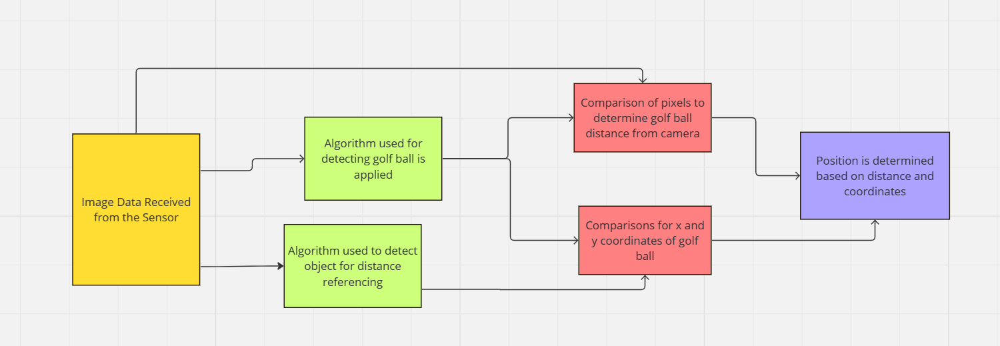
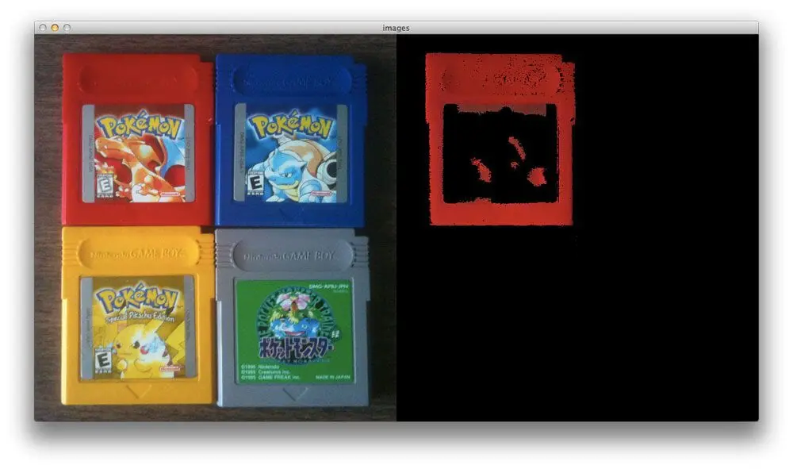
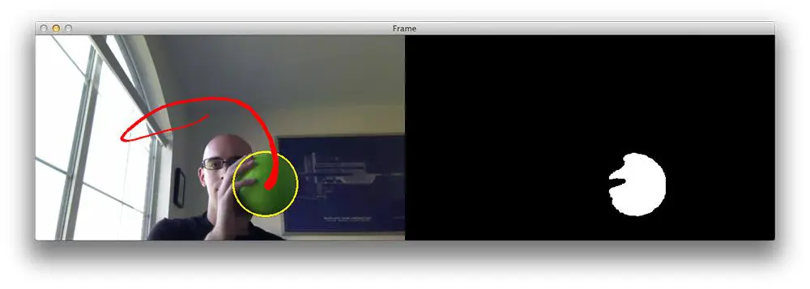

# Image Processing Subsystem

**Function:**

The goal of this subsystem is to receive and process the data from the camera sensor to determine the position and speed of the practice golf ball.  

**Constraints:**

| NO. | Constraint                                                          | Origin           |
|-----|---------------------------------------------------------------------|------------------|
| 1| Must be able to distinguish the golf ball from surroundings based on golf ball's color| System Requirment|
| 2| Must be able to extract the x,y coordinates of the golf ball with an inch of accuracy to distinguish between the wires and variable height| System Requirment|
| 3| Must be able to recieve the data and perform calculations in 250 ms to allow the interceptor time to aim and shoot based on the calculations| System Requirment|

1. In order for the system to properly detect the golf ball and extract the necessary information for aiming, the system needs to distinguish the golf ball
   from the rest of the image.
2. The program needs to use the coordinates from the camera to provide coordinates for aiming at the appropriate fishing line the golf ball is on. The
   fishing lines are about four inches apart at the start of the trajectory. The coordinates also locate which variable height the ball is at which differ
   by about seven inches. If the coordinates are off by an inch, the correct wire can be adjusted to the closest wire for those coordinates. One inch allows
   the wire to be determined since it will not be in between two wires. If it was two inches of error, the ball could be two inches to the right or left
   and could be one of two wires. The variable height differs by seven inches, so an inch away from the correct variable height can be corrected to the
   proper height from the data. A correction to the closest possible coordinates of the golf ball can be made from the detection with this error allowance.
3. The fastest speed of the golf ball is 1.95 seconds from empirical data from the customer. The ball needs to be detected in enough time for the team to
   aim the launcher and launch the projectile. This minimum allows time for the motors to make adjustments and fire after the information has been recieved
   and interpreted which is expected to take half a second each.

**Buildable Schematic**

The system is purely software. Any connections for the processor should be shown in that subsystems schematic.

A flow chart of the code is given below.

This shows the steps for each major calculation and what is necessary for each calculation. This process will be done twice to recieve two positions for the
speed calculation done by the processor.

**Analysis:**

*Detection*

The golf ball will be wrapped in foil and painted matte red. This will allow the object to be tracked using color. This can be done using a red, green, and
blue color detection. The boundaries for the color are determined and entered in as limits. For these purposes, red will have the highest boundaries while
green and blue will be much lower but still there to account for slight shading differences in the environment. These parameters and the image are then sent
to a function called inRange. This will apply a mask to the array of pixels repersenting the image with a maske to determine the objects with the color.
The results of such operations and algorithms can be seen below.

This can be adjusted to detect the ball at longer distances when the amount of pixels repersenting the object are smaller. The Big O analysis of this
function would be O(n) because it is an iterative function that will go through all of the pixels provided [1]. For more cluttered environments with
variety of color and lighting, objects can still be detected and tracked. An example of this can be seen below [2].

This uses the same algorithm, but applies it to an environment with varying light sources and colored backgrounds showing that the ball can still be
identified.

*Distance and Coordinates*

The distance of the object can be found using another iterative function for another linear algorithm. The camera returns an array with the depth of each 
pixel. This array is compared with the array holding the pixels that repersent the golf ball. The result is the depth of each pixel of the golf ball.

The object's coordinates can be determined through comparisons. Using edge of the field of view (FOV), the coordinates can be found. The pixels in between
the edge and the object can be counted. Using the width each pixel repersents, the total distance can be found. The pixel width repersentation can be found using the equations 

FOV width = 2 * tan(FOV/2) * distance and FOV height = 2 * tan(FOV/2) * distance

width per pixel = FOV width/horizontal resolution and height per pixel = FOV height/vertical resolution

The distance detemination will be used to fill in the distance variable in the equation. For the distance of six feet the result will be

FOV width = 2 * tan(69/2) * 6 = 8.25 feet and FOV height = 2 * tan(42/2) * 6 = 4.61 feet

width per pixel = 8.25/1920 = 0.004296 feet/pixel * 12 = 0.05155 inches/pixel

height per pixel = 4.61/1080 * 12 = 0.004265 feet/pixel = 0.05118 inches/pixel

The amount of inches for the width and height of the pixels can be used to find out the x and y coordinates by multiplying the pixels by the numbers
provided [3 & 4]. The accuracy of this method is high because it uses the size of the pixel based on the distance and should have enough pixels to find the
distance. This should allow about 0.1 inches of error for the coordinates if there is a missing pixel at the edge of the camera's view and by the golf
ball. Six feet is the maximum distance the golf ball will be from the camera, so the one inch of error will be achievable. These calculations are basic
arthemetic and should be O(1). Counting the pixels is another O(n) operation.

*Speed*

The camera that is being used is an 1920 by 1080 pixels. Benchmarks for the Jetson Nano Developer Kit show that for a 1920 by 1080 pixel image can process 
102 frames per second to find color and do several image alterations which is the same length as finding distance based on the Big O analysis. This means it
takes 9.8 ms to process the image information [6]. The camera takes in 30 frames per second so it takes 33.33 ms to get a new image. The USB cord connecting
the processor and camera processes data at 5 Gbs. Each pixel is 8 bits and has 2 color repersentation bytes so the total is 

8 * 2 * 1080 * 1920 = 0.03318 Gb. 

Taking the amount of data over the rate of transfer gives 

0.03318 Gb/5 Gbs = 6.64 ms. 

The arithmetic processes for determining speed and other calculations to send to the launcher are considered to have O(1). This means the most limiting time
factor is how long it takes to get two positions. 

33.33 ms + 6.64 ms + 9.8 ms + 33.33 ms + 6.64 ms + 9.8ms = 99.54 ms. 

This time period is well within the almost 1/8 time of the ball's travel given for the data to be collected and processed for the aiming and launching.

**Bill of Materials:**

This subsystem is implemented as part of the processor. No additional parts needed.

**References:**

[1] A. Rosebrock, “OpenCV and python color detection,” PyImageSearch, https://pyimagesearch.com/2014/08/04/opencv-python-color-detection/ 
(accessed Apr. 15, 2024). 

[2] A. Rosebrock, “Ball tracking with opencv,” PyImageSearch, https://pyimagesearch.com/2015/09/14/ball-tracking-with-opencv/ (accessed Apr. 17, 2024). 

[3] R. Awati, “What is field of view (FOV)?,” WhatIs, https://www.techtarget.com/whatis/definition/field-of-view-FOV (accessed Apr. 20, 2024). 

[4] “Understanding image quality on the MV32,” Cisco Meraki Documentation,
https://documentation.meraki.com/MV/Viewing_Video/Understanding_Image_Quality_on_the_MV32 (accessed Apr. 20, 2024). 

[5] “How to measure pixels on your screen with screen ruler,” ZDNET, https://www.zdnet.com/article/how-to-measure-pixels-on-your-screen-with-screen-ruler/
(accessed Apr. 20, 2024). 

[6] F. Serzhenko, “✅ Jetson nano benchmarks for image processing,” fastcompression.com - GPU Image Processing Software,
https://www.fastcompression.com/blog/jetson-nano-benchmarks-image-processing.htm (accessed Apr. 15, 2024). 
