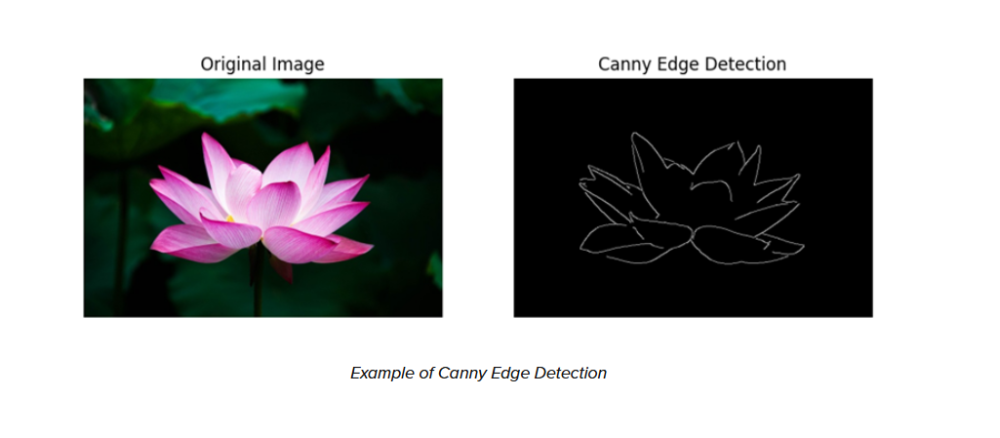

# Image Processing Subsystem

**Function:**

The goal of this subsystem is to receive and process the data from the camera sensor to determine the position and speed of the practice golf ball.  

**Constraints:**

| NO. | Constraint                                                          | Origin           |
|-----|---------------------------------------------------------------------|------------------|
| 1| Must be able to distinguish the golf ball from surroundings based on golf ball's shape and color using contrast techniques | System Requirment|
| 2| Must be able to extract the x,y coordinates of the golf ball with an inch of accuracy to distinguish between the wires and variable height| System Requirment|
| 3| Must be able to recieve the data and perform calculations in 250 ms to allow the interceptor time to aim and shoot based on the calculations| System Requirment|

1. In order for the system to properly detect the golf ball and extract the necessary information for aiming, the system needs to distinguish the golf ball
   from the rest of the image. Illumination techniques will also be used with lights on the device to increase the contrast between the object and the
   background. Then, edge and countour detection techniques will be used to find the golf ball based on it's round shape.
2. This can be done for both an inch to the left and an inch to the right for the x coordinate and an inch above or below for the y. The possible
   coordinates for the ball on the wire will be stored in the processor. The coordinates can be compared to a known wire coordinate of x,y and compare the
   identified value, repersented as x', x'+1, and x'-1 to find out which x coordinate the ball is located at. The same can then be done with the y
   coordinate to find its value. The addition and subtraction comparisons will also be adjusted where if x'+1 is either equal to x or greater than x
   and less than or equal to x+1 and x'-1 is either equal to x or less than x and greater than or eqaul to x-1 if the difference is less than an inch
   between them. If x = x' then the value will be what was detected without a correction being performed. If it was two inches of error, the ball could be
   two inches to the right or left and could be one of two wires using this method. If each x value is four inches apart, x'-2 could be equal to x1-2 and
   x2+2. An example of this would be if x' is 3, x1 is 5, and x2 is 1. The error margin would allow the determination of the exact wire the golf ball is on
   to be made. This would make the proper wire detection indeterminable. If given the same wire locations and x' as 4 since the error is now one inch, the
   wire can now be determined as x1 since x'+1 is equal to x. The variable height differs by seven inches, so an inch away from the correct variable height
   can be corrected to the proper height from the data as well using the same logic and processes. A correction to the closest possible coordinates of the
   golf ball can be made from the detection with an error of one inch. This has to be done at the furthest point to ensure enough time is left to perform
   calculations and intercept the incoming golf ball.
3. The fastest speed of the golf ball is 1.95 seconds based on empirical data from the customer. The ball needs to be detected in enough time for the
   launcher to aim and launch the projectile. This minimum allows time for the motors to make adjustments and fire after the information has been recieved
   and interpreted which is expected to take half a second each. It also allows the speed calculation to take 250 ms as well.

**Buildable Schematic**

The system is purely software. Any connections for the processor should be shown in that subsystems schematic.

A flow chart of the code is given below.

This shows the steps for each major calculation and what is necessary for each calculation. This process will be done twice to recieve two positions for the
speed calculation done by the processor.

**Analysis:**

*Detection*

The golf ball will be illuminated with lights from the device. This will allow the object to be tracked using color since the white golf ball can be
distinguished from the light altered background. This can be done using hue, saturation, and variation color detection. The boundaries for the color are
determined and entered in as limits. These parameters and the image are then sent to a function called inRange. This will apply a mask to the array of 
pixels repersenting the image with a mask to determine the objects with the color. The results of such operations and algorithms can be seen below to
detect a light color like grey.

This can be adjusted to detect the ball at longer distances when the amount of pixels repersenting the object are smaller. The Big O analysis of this
function would be O(n) because it is an iterative function that will go through all of the pixels provided [1].

Once the golf ball has been detected based on color, the pixels repersenting the color can have an edge detection algorithm applied to it. The canny edge
detection would be best suited for this since it not only filters our non-edges but also sets edges as weak and strong. The golf ball will have very
strong, round edges making it highly detectable by the algorithm. The adjustable ranges to define an edge used by the open sources cv function also make it
ideal. The results of calibrated canny edge algorithms can be seen below [2].

The Big O analysis of this function would also be O(n) since it is an iterative function through the pixels to determine if it has the qualities of an
edge. This function is most effective when the image has been cleaned and processed which is another O(n) analysis.

*Distance and Coordinates*

The distance of the object can be found using another iterative function for another linear algorithm. The camera returns an array with the depth of each 
pixel. This array is compared with the array holding the pixels that repersent the golf ball. The result is the depth of each pixel of the golf ball.

The object's coordinates can be determined through comparisons. Each pixel will appear to be a certain width and height. The results of the detection 
algorithm can be used to only determine the dimensions of each pixel of the object. The pixel width and height repersentation can be found with the 
following equations:

FOV width = 2 * tan(FOV/2) * distance and FOV height = 2 * tan(FOV/2) * distance

width per pixel = FOV width/horizontal resolution and height per pixel = FOV height/vertical resolution

The distance detemination will be used to fill in the distance variable in the equation. For the distance of six feet the result will be

FOV width = 2 * tan(69/2) * 6 = 8.25 feet and FOV height = 2 * tan(42/2) * 6 = 4.61 feet

width per pixel = 8.25/1920 = 0.004296 feet/pixel * 12 = 0.05155 inches/pixel

height per pixel = 4.61/1080 * 12 = 0.004265 feet/pixel = 0.05118 inches/pixel

The amount of inches for the width and height repersented by the pixels can be used to find out the x and y coordinates by multiplying the pixels by the
numbers provided [3 & 4]. The x and y coordinates can then be found by determining the pixel's coordinate in the image based on the array value of the
pixel from the original image. Then, use the calculated pixel repersentation to multiple the image coordinate with the real world repersentation. This 
should provide the real world x and y coordinates of the object. Six feet is the maximum distance the golf ball will be from the camera, so the one inch of
error will be achievable. These calculations are basic arthemetic and should be O(1). Counting the pixels is another O(n) operation, but the n number of
pixels is significantly smaller due to the altered array from detecting the object.

*Speed*

The camera that is being used is an 1920 by 1080 pixels. Benchmarks for the Jetson Nano Developer Kit show that for a 1920 by 1080 pixel image can resize
images in 10 ms [6]. This is an iterative process with O(n) time so it can be assumed other iterative processes with similar computation complexities will
have the same runtime. The function for cleaning up the image, assigning an edge value to each pixel, finding the countours, and any neccessary filtering
are all iterative. Each will run for 10 ms for a total of 40 ms to detect the golf ball. The camera takes in 30 frames per second so it takes 33.33 ms to
get a new image. The USB cord connecting the processor and camera processes data at 5 Gbs. Each pixel is 8 bits and has 2 color repersentation bytes so the
total is 

8 * 2 * 1080 * 1920 = 0.03318 Gb. 

Taking the amount of data over the rate of transfer gives 

0.03318 Gb/5 Gbs = 6.64 ms. 

The arithmetic processes for determining speed and other calculations to send to the launcher are considered to have O(1). This means the most limiting time
factor is how long it takes to get two positions. 

33.33 ms + 6.64 ms + 40 ms + 33.33 ms + 6.64 ms + 40 ms = 159.94 ms. 

This time period is well within the almost 1/8 time of the ball's travel given for the data to be collected and processed for the aiming and launching. It
gives nearly 7/8 of the remaining time to determine the speed and location of the ball which will then be used to aim and intercept the ball. Atfter the
estimated 250 ms to calculate the speed and half a second each to aim and launch, 400 ms is left for the projectile to travel and intercetp the golf ball.

**Bill of Materials:**

This subsystem is implemented as part of the processor. All camera and lighting information is part of the sensor. No additional parts needed.

**References:**

[1] A. Rosebrock, “OpenCV and python color detection,” PyImageSearch, https://pyimagesearch.com/2014/08/04/opencv-python-color-detection/ 
(accessed Apr. 15, 2024). 

[2] C. Writer, “Edge detection in image processing: An introduction,” Roboflow Blog, https://blog.roboflow.com/edge-detection/ (accessed Jun. 29, 2024). 

[3] R. Awati, “What is field of view (FOV)?,” WhatIs, https://www.techtarget.com/whatis/definition/field-of-view-FOV (accessed Apr. 20, 2024). 

[4] “Understanding image quality on the MV32,” Cisco Meraki Documentation,
https://documentation.meraki.com/MV/Viewing_Video/Understanding_Image_Quality_on_the_MV32 (accessed Apr. 20, 2024). 

[5] “How to measure pixel size for image processing? | Researchgate,” ResearchGate,
https://www.researchgate.net/post/How_to_measure_pixel_size_for_image_processing (accessed Apr. 20, 2024). 

[6] F. Serzhenko, “✅ Jetson nano benchmarks for image processing,” fastcompression.com - GPU Image Processing Software,
https://www.fastcompression.com/blog/jetson-nano-benchmarks-image-processing.htm (accessed Apr. 15, 2024). 
