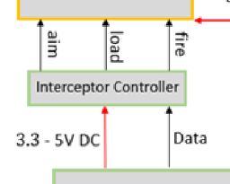
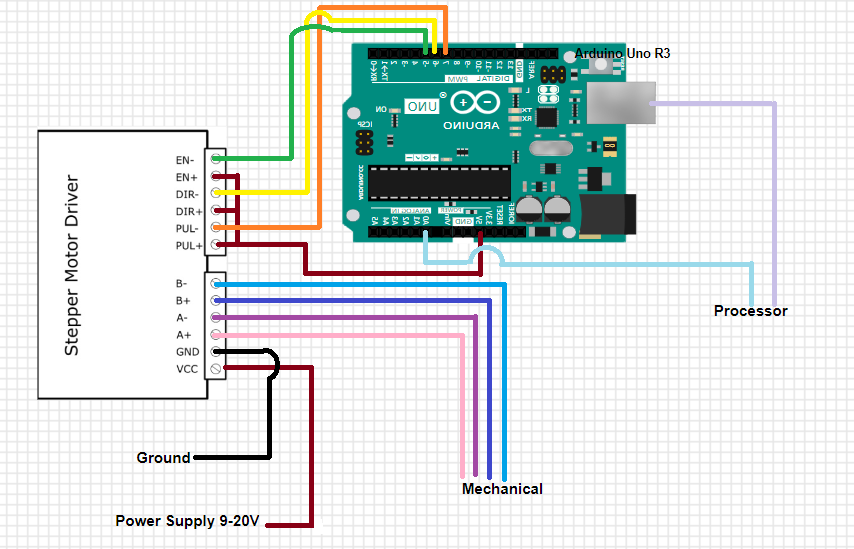
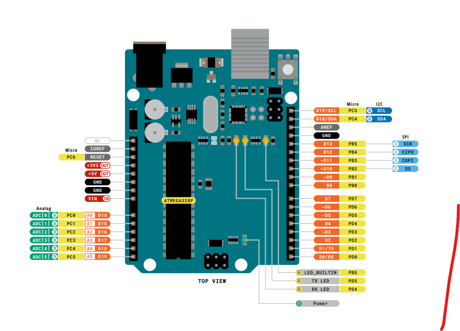

# Interceptor Controller Subsystem

## **Function:**

Figure 1: Interceptor Controller Subsystem

The goal of this subsystem is to take the outputs from the processer and convert them into inputs that can be used for the mechanical system. 

## **Constraints:**

|No.|Constraint|Origin|
|--|------|-------|
|1|The Interceptor Controller shall move firing mechanism to 1 of 30 locations |Conceptual Design|
|2|Must send back signal when aiming is finished to initiate firing | Conceptual Design |
|3|Must turn initiate firing| Conceptual Design
|4|Must be powered with a 6 to 20V voltage source | Device Constraint|
|5|Maximum current per I/O pin is 20mA| Device Constraint|
|6|Maximum current per +3.3V pin is 50mA| Device Constraint|
|7|Maximum voltage for the Stepper Motor 4 to 92V| Device Constraint|

1.	Using the data sent by the processor it converts it digital as coordinates that correspond to 1 of 30 set positions.
2.	After completing the movement to the desired position, a signal is sent back to the processor.
3.	After sending a signal from the Interceptor Controller another signal is sent back from the processor to initiate the firing of the projectile.
4.	To ensure that the device is powered safely a 6 to 20V power supply is needed but, has a barrel plug connector that works with a standard 9V battery.
5.	Per the data sheet the I/O pins are only regulated for 20mA.
6.	Per the data sheet the +3.3V pins are only regulated for 50mA.
7.	Per the data sheet a max of 92V can be applied.

## **Buildable Schematics:**

Figure 2: Buildable Schematic

## **Analysis:**
Arduino Analysis:

Due to the Arduinos variety of uses and applications it was the best choice to convert the analog data being provided from processor to digital logic that the mechanical system can understand. Shown in Figure 3 below we can see the JDIGITAL pins are the outputs of the Arduino but are the inputs for the mechanical system satisfying the first constraint. As for sending the signal back to the processer the analog side is used since that is the language the processer uses satisfying the third constraint. To ensure that the Arduino does not have any current going into the I/O pins a Stepper Motor is there to increase the current going into the motor to make it run as well as keep the current from going in reverse bias and frying the Arduino. Using these two devices speed, rotation, and direction can be changed. The speed is dictated my the power given to each motor *This measurement will be supplied by the ME team based on constraints and parameters of the competition*.

Stepper Motor Integration:

The Arduino UNO R3 seamlessly integrates with the TB6600 Stepper Motor Driver to control the interceptor's aiming mechanism [7]. Through GPIO communication, the Arduino UNO R3 commands the stepper motor driver to adjust the interceptor's position, aligning it with the golf ball's predicted path. Real-time trajectory data calculated by the Jetson Nano guides precise motor movements, ensuring accurate interception. The compatibility between theArduino UNO R3 and TB6600 Stepper Motor Driver facilitates seamless communication and system integration. The stepper motor will be put into a zero position. While it is in its zero position, the jetson nano can count how many steps the motor takes to determine the correct aiming position. This can apply for the X-Axis and Y-Axis of the system to be able to reset the interceptor back to the zero position after each time it aims and fires at the incoming golf ball [6].

Figure 3[1]

## **Bill of Materials:**

|Device|Quantity|Price|Total|
|-------|---|---------|-------------|
| Arduino |1|$27.60|$27.60|
|B6600 Stepper Motor Driver|3|$24.07|$72.21|
| | |Final Total|$99.81|

## **References:**
[1] Arduino, https://docs.arduino.cc/resources/pinouts/A000066-full-pinout.pdf (accessed Apr. 17, 2024). 

[2] Arduino, https://docs.arduino.cc/resources/schematics/A000066-schematics.pdf (accessed Apr. 17, 2024). 

[3] Arduino, https://docs.arduino.cc/resources/datasheets/A000066-datasheet.pdf (accessed Apr. 17, 2024). 

[4] Admin, Technology tutorials, https://toptechboy.com/arduino-tutorial-37-understanding-how-to-control-dc-motors-in-projects/ (accessed Apr. 17, 2024). 

[5] R. Sawkare, “Arduino Uno R3 with l293d motor driver,” Medium, https://vayuyaan.medium.com/arduino-uno-r3-with-l293d-motor-driver-550c4a65f612 (accessed Apr. 17, 2024). 

[6] “TB6600 Stepper Motor Driver,” Bulkman, https://bulkman3d.com/wp-content/uploads/2019/06/TB6600-Stepper-Motor-Driver-BM3D-v1.1.pdf (accessed Apr. 8, 2024).

[7] “TB6600 Stepper Motor Driver,” DFRobot, https://www.dfrobot.com/product-1547.html (accessed Apr. 8, 2024).

[8] S. Hall, Devcom. Devcom, 2024. S31 Paper Wad Interceptor Challenge 2024, Rulebook, (accessed Apr. 8, 2024).
