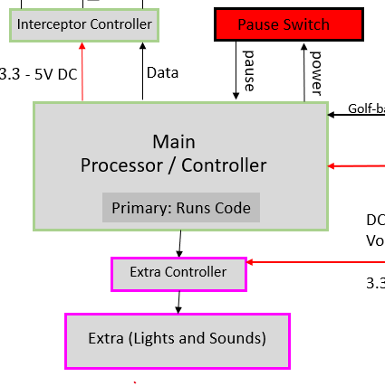
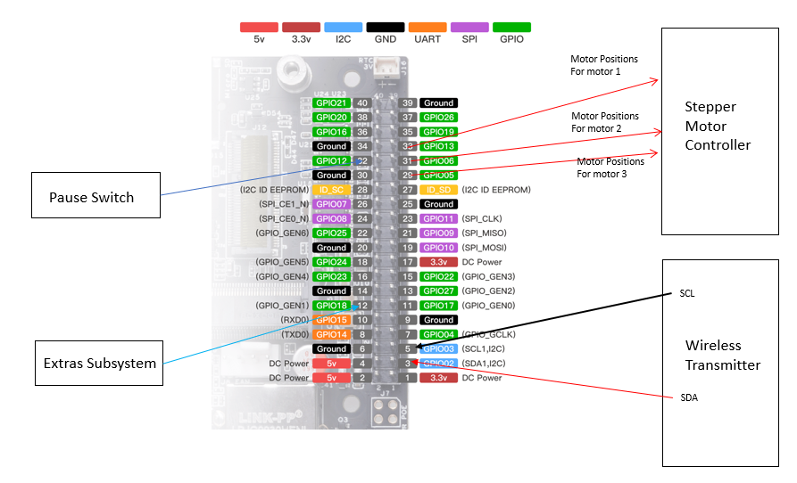

# **Function:**

*Figure 1: Main Processor Overview*

The main processor unit is responsible for receiving, analyzing, and interpreting data from the image-detecting system to calculate and aim the interceptor. Its primary function revolves around processing data related to a golf ball's trajectory in real time. The Jetson Nano serves as the brain of the system, consolidating data from the local camera that passes the data to the main processor.

## **Constraints:**

| NO. |	Constraint | Origin |
|-----|------------|--------|
| 1	| Time Constraints - Real-time data processing for trajectory prediction for the golf ball speed varying from 1.9 seconds to 7.4 seconds | System Constraint |
| 2	| Processing Speed - Optimization for efficient calculations to calculate the speed, wire, and variable height in time| System Constraint |
| 3	| Signal Interpretation Challenges - Ensuring accurate data interpretation that is received from external boards | Programming Constraint |
| 4	| Resource Utilization - Preventing overload of system resources since the board has 1.43GHz with quad cores, want to utilize them for speed efficiency | System Constraint |
| 5 | Pausing Processes: The system needs a pause state to stop other scripts from activating firing mechanisms. | Rulebook |

## **Fulfilling Constraints:**

**Time Constraints:** Real-time processing of sensor data and trajectory calculations impose time constraints on the Jetson Nano. Since it has to be able to detect and calculate the proper position of the ball. Its 1.43GHz quad-core ARM Cortex-A57 the processor needs to be able to receive, process, calculate the interceptor’s path, and aim the interceptor before the golf ball gets too far down the string [3]. THe ball's travel time varies from 1.9 seconds to 7.4 seconds and the programs and data transmission needs to be optimized for an accurate and efficient system to be able to run fast enough. Delays in data acquisition, processing, or interceptor firing may affect the interception accuracy dramatically [2].

**Processing Speed:** Complex calculations and simultaneous tasks may strain the processing capabilities of the Jetson Nano, potentially leading to performance bottlenecks. Optimizing algorithms and utilizing hardware and multi-core techniques can help minimize processing speed limitations.

**Signal Interpretation Challenges:** Variability in wireless signal strength, interference, and environmental factors may pose challenges in accurately interpreting sensor data. The Jetson Nano needs to be able to filter all signals, determine accurate data that it receives and predict the golf balls trajectory will require enormous testing and a versatile system. An accurate signal-processing algorithm and error-handling backup codes are going to be essential for creating reliable data for the system.

**Resource Utilization:** With 4GB of LPDDR4 RAM, the Jetson Nano offers ample memory for concurrent tasks. However, efficient resource management is imperative to prevent resource overload. Optimization strategies focus on minimizing memory usage and CPU load, preserving system responsiveness [2].

**Pausing Processes:** Since the rulebook from Devcom states the requirement for a pause switch integrated with the interceptor to stop the machine from firing, the system will require an integrated switch to halt operations inside the Jetson Nano [9].

# **Buildable Schematic:**

*Figure 2: Jetson Nano Wiring Schematic*

## **Analysis of Using Jetson Nano:**

Python remains the primary programming language for interfacing with the Jetson Nano due to its versatility and extensive libraries. Additionally, C++ may be employed for computationally intensive tasks, leveraging the Jetson Nano's GPU for accelerated computations. [5]

**Hardware Configuration:** The Jetson Nano interfaces with the other hardware components with the GPIO pins. GPIO pins such as GPIO05, GPIO06, GPIO13, GPIO12, and GPIO18 facilitate flexible input/output operations, accommodating sensor connections and interceptor control. While using GPIO02 and GPIO03 for the SCL and SDA data [3].

**Programs and Tasks:** Custom Python scripts orchestrate various system tasks, including signal processing, trajectory calculations, and interceptor control. Multithreading may be applied to enable concurrent execution of tasks, maximizing system efficiency.

**Data Processing and Calculations:** Upon receiving the image detection data, the Jetson Nano executes trajectory calculations to determine the golf ball's velocity, height, distance, and direction. Mathematical algorithms will be used to accurately determine the data.

The height calculations will need the height of the camera, the image height of the bounding box in pixels, and the physical height of the two possible positions [1]. The given information from the image processing will be the given X-Axis and Y-Axis that will be used to determine the object height. Since the ball ranges from 43 inches to 50 inches in height, the system can figure out the wire the ball is on and the height the ball will be on.
~~~math
Object Height = ( Physical Height * Y-Axis )/( Image Height ) + Ball Offset
~~~
~~~math
Object Height = (4 inches * 730 pixels ) / ( 1080 pixels) + 42 inches
~~~
~~~math
= (2,920 pixel inches)/(1080 pixels) + 42 inches = 44.7 inches
~~~

The Speed calculations will be taking the distance or position of the object over time [1]. The frames of the objects location can calculate the speed using the following equation. The speed calculations will be determined using different distances and time frames that have been sent from the image detection to figure out how fast the ball is traveling. While using backlogged data of testing speeds, the system will also figure out speeds and compare to increase the overall accuracy of the speed [1].
~~~math
Speed = (DistanceOne - DistanceTwo) / Change in Time Between Frames
~~~
~~~math
Speed = (53 inches - 48 inches) / (0.1692 seconds)
~~~
~~~math
= (5 inches)/(0.1692 seconds) = 29.55 inches/second
~~~

**Signal Interpretation:** The Jetson Nano will need signal processing techniques to interpret wireless sensor data accurately. Noise filtering and error correction mechanisms enhance signal clarity, enabling precise trajectory prediction.

**Control of Golf Ball Interceptor Shooter:** Based on the calculated trajectory data, the Jetson Nano will control the timing and activation of the golf ball interceptor shooting mechanism. It needs to have the interceptor to be properly aligned towards the golf ball's predicted path, and fire at the appropriate time to hit the ball mid-air. The Jetson Nano will send all the required data of the x-axis, y-axis, and firing signals to the arduino controlling the interceptor. This could use preset fire positions to optimize the interception process [6,7].

## **Analysis of Board Component Integration:**

**Pause Switch Analysis**

When the switch gives a positive 5 Volts to the Jetson Nano, we need to stop scripts from enabling the interceptor firing mechanism to halt any inappropriate firing. This adds a safety measure that the rulebook was requesting [9].

**Arduino Integration**

The Jetson Nano will integrate with the interceptor's Arduino controller aiming mechanism [7]. Through GPIO communication, the Jetson Nano commands the Arduino  to adjust the interceptor's position, aligning it with the golf ball's predicted path.

Real-time trajectory data calculated by the Jetson Nano will then wait for the Arduino to send back a confirmation signal to confirm the position of the interceptor. This can apply to the X-Axis and Y-Axis of the system to be able to know if the interceptor controller aimed to the correct position [6].

A second Arduino will control all the extras will send signals when aiming, and possibly firing signals for the extra subsystem that controls the sounds and lights.

## **Cost Analysis:**
|Name|	Count|	Price |	Total |
|---|---|---|---|
|Jetson Nano 945-13450-0000-000|	1|	$229.38|	$229.38|
| Total | | | 			$229.38|

The Jetson Nano offers an affordable yet powerful solution for system control, priced at $229.38 [4]. This ensures cost-effectiveness without compromising performance for doing image processing calculations.

## **References:**

[1] N. shukla, “A review on image based target distance & height ...,” Research Publish, https://www.researchpublish.com/upload/book/A Review on Image Based Target Distance-1172.pdf (accessed Apr. 11, 2024). 

[2] “NVIDIA® Jetson Nano 4GB development kit,” OKdo, https://www.okdo.com/us/p/nvidia-jetson-nano-4gb-development-kit/ (accessed Apr. 11, 2024).

[3] “Jetson nano developer kit by Nvidia: 945-13450-0000-000,” Arrow.com, https://www.arrow.com/en/products/945-13450-0000-000/nvidia (accessed Apr. 11, 2024).

[4] Walmart, https://www.walmart.com/ip/NVIDIA-Jetson-Nano-Developer-Kit/480691437?wmlspartner=wlpa&selectedSellerId=11832&adid=22222222227480691437_11832_146045225401_18612869729&wl0=&wl1=g&wl2=c&wl3=628562918858&wl4=aud-2225087348107%3Apla-1838654855916&wl5=1025954&wl6=&wl7=&wl8=&wl9=pla&wl10=117079748&wl11=online&wl12=480691437_11832&veh=sem&gad_source=1&gclid=Cj0KCQjwlN6wBhCcARIsAKZvD5jwTYJgdMQqUTOA0_bi87XId5dExtSr0RrJbe0Hu2oBk9rWw8MvXPMaAoahEALw_wcB (accessed Apr. 11, 2024).

[5] Dr. M. Nazeer, M. Qayyum, and A. Ahad, “Real time object detection and recognition in machine learning using Jetson Nano,” SSRN, https://papers.ssrn.com/sol3/papers.cfm?abstract_id=4286087 (accessed Apr. 11, 2024). 

[6] “Five steps to connect Jetson Nano and Arduino,” Rareschool, https://blog.rareschool.com/2019/05/five-steps-to-connect-jetson-nano-and.html (accessed Apr. 17, 2024).

[7] “Connecting Jetson Nano to Arduino Uno,” NVIDIA, https://forums.developer.nvidia.com/t/connecting-jetson-nano-to-arduino-uno/172775 (accessed Apr. 17, 2024).

[8] “Toggle switches,” NTE Electronics, https://www.nteinc.com/switches/pdf/toggle-std.pdf (accessed Apr. 6, 2024).

[9] S. Hall, Devcom. Devcom, 2024. S31 Paper Wad Interceptor Challenge 2024, Rulebook, (accessed Apr. 8, 2024).
